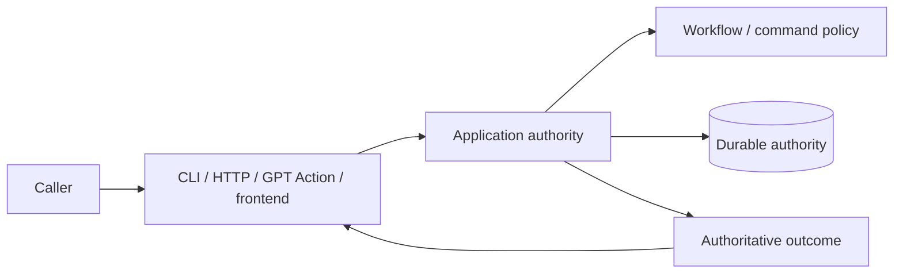

# Commands and surfaces

## Read this when

Read this when changing CLI, HTTP, GPT Action, admin, frontend command exposure, result guidance, or OpenAPI.

## Scope

This document separates command semantics from surface-specific behavior. It does not assume that transports are thin or logic-free.

## Authoritative implementation

Current anchors include `dish_service/cli.py`, `dish_service/admin_cli.py`, `dish_tool/command_identity.py`, `dish_service/command_spec.py`, `dish_tool/admin_command_spec.py`, `dish_service/http_routing.py`, `dish_service/http.py`, `dish_service/auth.py`, `dish_service/openapi.py`, and application command handlers.

Stable connected-agent command names are owned below transport composition by `dish_tool/command_identity.py`. `ACTION_COMMAND_DEFINITIONS` in `dish_service/command_spec.py` must cover that identity set exactly and remains authoritative for Action-specific principal, request-ID/replay, route, workflow-link, validation, and schema metadata. The generated Action schema derives from those service definitions. A command existing elsewhere in CLI/application code does not by itself mean that the connected GPT can call it.

## Actors, processes, and stores

Agent CLI, admin CLI, GPT Action, and frontend are caller surfaces. They may expose overlapping capabilities with different authentication, presentation, or context.

## Authority and data ownership

Connected-agent command identity/exposure membership is shared lower-level metadata; service command specifications add transport-specific policy without redefining those names. Workflow authority determines whether a consequential transition is legal. A surface decides how to expose, describe, collect arguments for, or present the authoritative result to its caller.

## Invariants

- A surface must not accidentally expose privileged/internal operations merely because a route or command exists elsewhere.
- Surface-specific guidance may add navigation, explanation, recovery instructions, or non-workflow affordances; it must not manufacture a workflow transition the backend considers legal when it is not.
- The public GPT Action transport may add `data.agent_guidance` derived from the canonical result. Guidance is contextual caller help, not workflow authority: it must not add or authorize legal actions, invent authoritative identifiers or state, or contradict `allowed_actions`.
- Command identity and replay classification should not be independently redefined in every surface.
- Overlapping capabilities across agent/admin/frontend surfaces are allowed when exposure and authorization are explicit.
- Do not claim that the deployed connected GPT can call a command solely because CLI/application code or source Action metadata supports it. Source exposure and deployed capability are distinct facts; deployed capability must be verified separately when making claims about the live surface.
- Normal human-facing recovery and hold handoffs present the meaningful blocker or decision first and keep lease/execution/hold identifiers, protocol plumbing, and exact admin mechanics in inspect/admin detail unless the human asks how to execute them. Commands presented as directly runnable must be runnable as shown; templates must be labeled as templates.

## Process and transaction boundaries

Transport validation, normalization, capability handling, and response adaptation may occur before/after application execution. Those concerns do not confer workflow authority.

## Normal flow

A surface authenticates/validates its protocol, maps the request into a shared command/application call, receives an authoritative result, and renders caller-appropriate output.

For the connected GPT specifically, checked-in source capability and the deployed Action schema can differ temporarily. The current shared Action specification is the source-side exposure contract; deployment synchronization is an operational concern.

### Current human admin presentation

`dish-admin` intentionally has a small normal operator surface even though older recovery and maintenance commands remain callable for exact handoffs and scripting. Root help presents the normal entry points (`issues`, `review-queue`, `inspect`, `active-leases`, `kill`, `kill-all`, and `kill-all-expired`); `attention` remains a hidden compatibility alias for `issues`. Low-level recovery, migration, backup, governance, and direct review mutation commands are compatibility/escape-hatch surfaces rather than the normal navigation model. Hiding a command from root help does not remove or weaken its backend authority checks.

`issues` is a read-only fleet summary over durable Dish state. It groups signals by Dish, distinguishes Marco-required/unsafe items from system/recoverable items, and deliberately performs no per-Dish live Asana inspection. An expired lease on an otherwise open/recoverable operation is a system/recoverable signal, not by itself a Marco-required issue. `issues` is therefore a fast triage surface, not an authority oracle: `inspect <dish>` remains the exact source for legal recovery actions. In a real terminal, issue rows can be selected to drill into that exact per-Dish inspect state without copying an identifier; durable Dish identity remains inspectable even when Marco has manually moved the Asana task outside the Cooking project. `--non-interactive`, `--json`, and non-TTY use remain one-shot. `active-leases` is likewise a durable read-only diagnostic; raw lease/run identifiers belong in verbose output.

`kill-all-expired` and `kill-all` are temporary dark-launch/operator conveniences built from the same exact-run revocation semantics as single-run `kill`; they are not lease-clearing shortcuts. They snapshot exact outstanding principals and apply the ordinary kill path per item, with confirmation and per-target outcomes. Snapshot preconditions prevent a renewed lease or a successor run from being killed accidentally. These bulk commands intentionally make no all-or-nothing claim and may be retired when routine stale ownership no longer needs manual intervention.

`audit` is a separate read-only confidence surface. It compares the configured Cooking-project population with durable Dish-known identities and classifies each Dish/task. Section, due date, and project membership are Marco-managed Asana organization fields during pre-cutover operation: audit may show them as context, but they must not by themselves produce `INCONSISTENT`. Audit is intended for durable population confidence work, not for deciding a legal workflow transition. `inspect --verbose <dish>` is the bounded per-Dish diagnostic drill-down: normal inspect remains consequence-first, while verbose mode exposes durable operation/cycle/request/effect/lease/revocation/proposal/history evidence needed to explain the compact result.

The default `review-queue` means items actually waiting for Marco (`pending`). Approved/claimed proposal states remain available through explicit status filters but do not inflate the normal decision inbox. Human Review items present the agent-written issue in ordinary language, then 1..N concrete choices with A as the durable recommended choice plus an always-available free-text Other path. The normal surface does not ask Marco to approve or dismiss an abstract "escalation". In a real terminal, selection first renders the exact durable review item and then offers its actual choices; semantic proposals still show the exact governed before/after bundle. Non-TTY output, `--json`, and `--non-interactive` preserve one-shot/scriptable behavior. Interactive selection uses the queue number only to select from the rendered snapshot; mutations target the selected durable review identity. Low-level review dismissal remains an exceptional compatibility/admin operation and is not advertised as a normal decision.

## Failure, replay, recovery, and concurrency

Mutation request identity/replay is handled by the shared replay mechanism. Surfaces may communicate recovery guidance but should not invent a second idempotency/retry identity model.

## Change routing

When adding a genuine backend command, update the shared command/application contract and whichever surfaces intentionally expose it. When changing only surface guidance or UX, it is legitimate to change only that surface if no backend semantic changes are required.

## Proving tests

Relevant current tests include `tests/test_action_surface.py`, `tests/test_action_surface_openapi.py`, `tests/test_transport.py`, and admin/Action contract tests. Prefer behavioral tests for behavioral guarantees. Structural tests are appropriate when structure itself enforces a security or authority boundary, but should not freeze incidental code layout.

## Current debt and temporary compatibility

The live connected-GPT schema and deployment can lag checked-in source schema; source capability and deployed capability are distinct operational facts. PostgreSQL command parity remains incomplete during migration.

## Related documents

- [Workflow and human review](workflow-and-human-review.md)
- [Request replay and idempotency](request-replay-and-idempotency.md)
- [System context](system-context.md)
