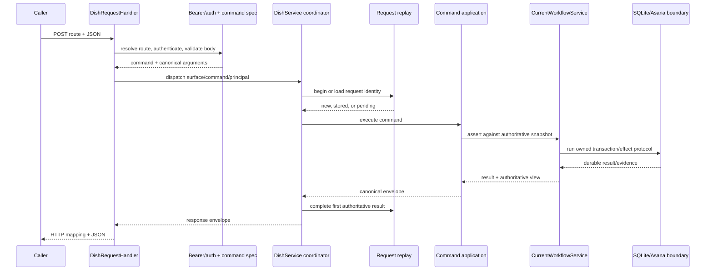

# Commands and surfaces

## Read this when

Read this when adding or changing a CLI command, private HTTP route, GPT Action route, admin operation, request body, result envelope, OpenAPI schema, or command classification.

## Scope

This document owns command discovery, route/surface boundaries, and the handoff from transport parsing to command authority. It does not own workflow legality.

## Authoritative implementation

- Agent CLI: `dish_tool/cli.py`.
- Admin CLI: `dish_tool/admin_cli.py`.
- Agent/Action command contract: `dish_service/command_spec.py`.
- Admin command registry: `dish_tool/admin_command_spec.py`.
- Canonical legacy result-field metadata: `dish_tool/results.py`.
- HTTP route recognition: `dish_service/http_routing.py`.
- HTTP validation and mapping: `dish_service/http.py`.
- Authentication: `dish_service/auth.py`.
- OpenAPI generation: `dish_service/openapi.py` and checked-in `openapi/dish-action.openapi.json`.
- Command applications: `dish_tool/commands.py`, `dish_tool/admin.py`.
- Human/admin action specification and terminal rendering: `dish_tool/human_actions.py`, `dish_tool/admin_human.py`; these render authoritative decisions but do not own workflow legality.
- PostgreSQL retained/retired command classification: `dish_pg/command_contract.py`.

## Actors, processes, and stores

Agent callers use the private `/v1/commands/{command}` surface; GPT Action uses `/v1/action/{command}`; admin callers use private `/v1/admin/...` routes. Lease and backup routes have dedicated path shapes. HTTP handlers do not directly mutate stores; they delegate to `DishService`.

## Authority and data ownership

`command_spec.py` owns typed Action command identity, principal class, request-ID policy, private route/CLI exposure, and argument schemas. `admin_command_spec.py` owns admin command identity, target kind, identifier field, lease/backend requirements, and supported transports. `results.py` owns canonical legacy result-field names and public required-field metadata. `http_routing.py` owns path recognition while reusing command identities from those descriptive sources. `DishApplication` and `DishAdminApplication` own command dispatch and result construction. `CurrentWorkflowService` owns whether a mutation is legal.

## Invariants

- Authenticate protected routes before loading/parsing the body.
- Reject duplicate JSON keys recursively, ambiguous media types, unknown fields, and invalid command shapes before workflow execution.
- Public Action exposure is an explicit allowlist; private/admin commands never become public by route coincidence.
- Read-only commands do not accept request IDs. Every externally callable mutation that supports replay requires a non-nil canonical request UUID.
- A result envelope does not reconstruct legal actions from a state string; it uses the exact authoritative view supplied by the workflow owner.
- CLI, HTTP, and OpenAPI derive classifications from shared registries rather than parallel hard-coded sets.

## Process and transaction boundaries

HTTP parsing ends after route, credential, media-type, JSON, client identity, and command-argument validation. Command authority begins when the service coordinator enters replay/lease/application execution. Workflow legality begins only in `CurrentWorkflowService` and `workflow_policy.legal_actions`.

## Normal flow

1. Resolve a declarative route pattern.
2. Authenticate against the route class.
3. Parse exactly one JSON object and validate command/client schemas.
4. Build a `ServicePrincipal` and delegate to the matching service coordinator.
5. Begin replay and lease gates for mutations.
6. Dispatch through the application to the owning workflow use case.
7. Return one canonical envelope; HTTP status remains transport metadata.

## Failure, replay, recovery, and concurrency

Expected authenticated Action rule failures remain canonical Dish envelopes instead of being hidden as generic transport errors. Authentication failures stay 401/403 and unexpected server failures stay 500. A changed command, owner, run, or canonical argument set under the same request ID is an identity conflict. Concurrent duplicate requests join the same durable identity rather than both executing.

## Change routing

- Add an Action command in `dish_service/command_spec.py`, HTTP dispatch, `DishApplication`, OpenAPI generation, and exact tests.
- Add an admin command in `dish_tool/admin_command_spec.py`, CLI/private HTTP argument builders, service classification, and `DishAdminApplication`.
- Put workflow preconditions in workflow policy/use cases, not command schemas.
- Put route shape in `dish_service/http_routing.py`, not an expanding handler conditional chain.
- Do not expose a PostgreSQL-only or operator command through the public Action schema without an explicit product decision.

## Proving tests

- `tests/test_action_surface.py` proves route exposure and private/public separation.
- `tests/test_action_surface_openapi.py` and `tests/test_action_model_validation.py` prove shared schema behavior.
- `tests/test_admin_command_spec.py` and `tests/test_admin_argument_validation.py` prove admin registry parity.
- `tests/test_transport.py` and `tests/test_transport_contract_resilience.py` prove HTTP boundary behavior.
- `tests/test_dish_cli_transport_errors.py` proves CLI transport mapping.
- `tests/postgresql/test_postgresql_action_openapi_oracle.py` proves target Action contract consistency.

## Current debt and temporary compatibility

The current service and PostgreSQL target have separate command registries because they represent different authority stages. For commands shared with the current Action surface, `dish_pg/command_contract.py` reuses current command identity, principal, and request-replay policy while continuing to own target-only profile, task/operation requirements, retention, and exposure decisions. It explicitly marks backup commands retired and must not silently redefine current legacy transport behavior. The private frontend OpenAPI is a separate artifact and is not merged with the Action schema.

## Related documents

- [Workflow and human review](workflow-and-human-review.md)
- [Request replay and idempotency](request-replay-and-idempotency.md)
- [System context](system-context.md)
- [`../runtime-contract.md`](../runtime-contract.md)
