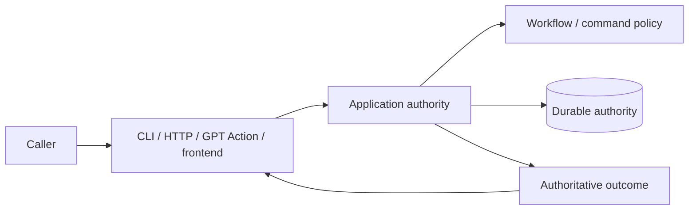

# Commands and surfaces

## Read this when

Read this when changing CLI, HTTP, GPT Action, admin, frontend command exposure, result guidance, or OpenAPI.

## Scope

This document separates command semantics from surface-specific behavior. It does not assume that transports are thin or logic-free.

## Authoritative implementation

Current anchors include `dish_service/cli.py`, `dish_service/admin_cli.py`, `dish_tool/command_identity.py`, `dish_service/command_spec.py`, `dish_tool/admin_command_spec.py`, `dish_service/http_routing.py`, `dish_service/http.py`, `dish_service/auth.py`, `dish_service/openapi.py`, and application command handlers.

Stable connected-agent command names are owned below transport composition by `dish_tool/command_identity.py`. `ACTION_COMMAND_DEFINITIONS` in `dish_service/command_spec.py` must cover that identity set exactly and remains authoritative for Action-specific principal, request-ID/replay, route, workflow-link, validation, and schema metadata. The generated Action schema derives from those service definitions. A command existing elsewhere in CLI/application code does not by itself mean that the connected GPT can call it.

## Actors, processes, and stores

Agent CLI, admin CLI, GPT Action, and frontend are caller surfaces. They may expose overlapping capabilities with different authentication, presentation, or context.

## Authority and data ownership

Connected-agent command identity/exposure membership is shared lower-level metadata; service command specifications add transport-specific policy without redefining those names. Workflow authority determines whether a consequential transition is legal. A surface decides how to expose, describe, collect arguments for, or present the authoritative result to its caller.

## Invariants

- A surface must not accidentally expose privileged/internal operations merely because a route or command exists elsewhere.
- Surface-specific guidance may add navigation, explanation, recovery instructions, or non-workflow affordances; it must not manufacture a workflow transition the backend considers legal when it is not.
- The public GPT Action transport may add `data.agent_guidance` derived from the canonical result. Guidance is contextual caller help, not workflow authority: it must not add or authorize legal actions, invent authoritative identifiers or state, or contradict `allowed_actions`.
- Command identity and replay classification should not be independently redefined in every surface.
- Overlapping capabilities across agent/admin/frontend surfaces are allowed when exposure and authorization are explicit.
- Do not claim that the deployed connected GPT can call a command solely because CLI/application code or source Action metadata supports it. Source exposure and deployed capability are distinct facts; deployed capability must be verified separately when making claims about the live surface.
- Normal human-facing recovery and hold handoffs present the meaningful blocker or decision first and keep lease/execution/hold identifiers, protocol plumbing, and exact admin mechanics in inspect/admin detail unless the human asks how to execute them. Commands presented as directly runnable must be runnable as shown; templates must be labeled as templates.

## Process and transaction boundaries

Transport validation, normalization, capability handling, and response adaptation may occur before/after application execution. Those concerns do not confer workflow authority.

## Normal flow

A surface authenticates/validates its protocol, maps the request into a shared command/application call, receives an authoritative result, and renders caller-appropriate output.

For the connected GPT specifically, checked-in source capability and the deployed Action schema can differ temporarily. The current shared Action specification is the source-side exposure contract; deployment synchronization is an operational concern.

### Current human admin presentation

`dish-admin` intentionally has a small normal operator surface even though older recovery and
maintenance commands remain callable for exact handoffs and scripting. Root help presents the normal
entry points in operator order: `inspect`, `queue`, `audit`, `active`, `kill`, `kill-all-expired`,
then `kill-all`. `issues`, `attention`, `review-queue`, and `active-leases` remain hidden
compatibility/detail aliases; low-level recovery, migration, backup, governance, and direct review
mutation commands remain callable escape hatches. Hiding a command from root help does not remove or
weaken its backend authority checks.

`queue` is the primary "what Marco needs to do now" surface over durable Dish state. It groups
Marco-required work by human consequence (Human Review, Evidence, change approval, then recovery),
hides system/auto-recoverable rows by default, and enters Human Review or Evidence interaction
directly from the rendered snapshot. Queue numbering is presentation only: any mutation targets the
selected durable review or Dish identity. `--non-interactive`, `--json`, and non-TTY use remain
one-shot. An expired lease on an otherwise open/recoverable operation is system/recoverable and does
not by itself re-enter Marco's queue. `inspect <dish>` remains the exact drill-down for recovery and
reconciliation cases without a dedicated interaction.

`active` is the normal read-only run-ownership diagnostic; `active-leases` remains its hidden
compatibility alias. Normal output keeps raw stage, lease, owner, and run identifiers out of the
operator path; verbose output exposes them for exact diagnostics. `kill-all-expired` and `kill-all`
remain temporary dark-launch/operator conveniences built from exact-run revocation semantics rather
than lease-clearing shortcuts. They snapshot exact outstanding principals and apply the ordinary kill
path per item, with preconditions preventing a renewed lease or successor run from being killed.

`audit` is a separate read-only population-confidence surface. It compares the configured
Cooking-project population with durable Dish-known identities. Section, due date, and project
membership are Marco-managed Asana organization fields during pre-cutover operation: audit may show
them as context, but they must not by themselves produce `INCONSISTENT`. Healthy/current and
expected/manual lifecycle rows are hidden by default and available with `--verbose`. Audit does not
decide workflow legality; `inspect --verbose <dish>` remains the bounded per-Dish diagnostic view.

Human Review items retain durable ranked choices with A as the recommended route plus free-text
Other. Semantic proposals retain exact governed before/after bundles. The queue may enter these
interactions directly, but approval/application authority remains in the existing review commands and
workflow policy.

## Failure, replay, recovery, and concurrency

Mutation request identity/replay is handled by the shared replay mechanism. A connected client may
repeat the same logical request after a transport failure only when no Dish envelope was received; it
must preserve the same run/request identity and stop blind retries as soon as Dish returns an
authoritative envelope. Surface guidance must not turn transport recovery into a second idempotency
model or encourage fresh IDs to bypass pending/uncertain work.

For canonical connected-agent handoffs, `read` accepts exactly one identity: a known `task_gid` or a
canonical `dish_id`. `read(dish_id=...)` resolves only against durable known task identities, returns
`data.identity_binding`, and has no title/section discovery fallback. This binding resolves identity
only; it does not select an operation or authorize a workflow transition.

## Change routing

When adding a genuine backend command, update the shared command/application contract and whichever surfaces intentionally expose it. When changing only surface guidance or UX, it is legitimate to change only that surface if no backend semantic changes are required.

## Proving tests

Relevant current tests include `tests/test_action_surface.py`, `tests/test_action_surface_openapi.py`, `tests/test_transport.py`, and admin/Action contract tests. Prefer behavioral tests for behavioral guarantees. Structural tests are appropriate when structure itself enforces a security or authority boundary, but should not freeze incidental code layout.

## Current debt and temporary compatibility

The live connected-GPT schema and deployment can lag checked-in source schema; source capability and deployed capability are distinct operational facts. PostgreSQL command parity remains incomplete during migration.

## Related documents

- [Workflow and human review](workflow-and-human-review.md)
- [Request replay and idempotency](request-replay-and-idempotency.md)
- [System context](system-context.md)
