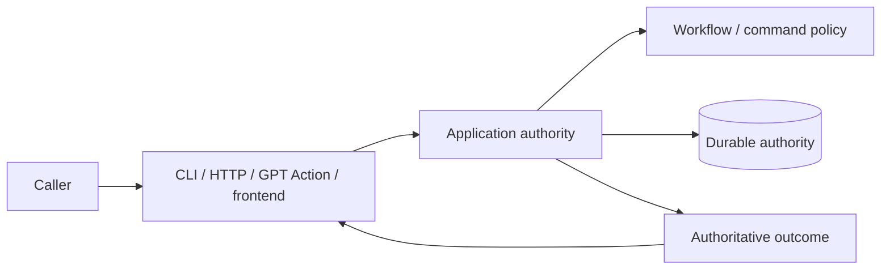

# Commands and surfaces

## Read this when

Read this when changing CLI, HTTP, GPT Action, admin, frontend command exposure, result guidance, or OpenAPI.

## Scope

This document separates command semantics from surface-specific behavior. It does not assume that transports are thin or logic-free.

## Authoritative implementation

Current anchors include `dish_service/cli.py`, `dish_service/admin_cli.py`, `dish_tool/command_identity.py`, `dish_service/command_spec.py`, `dish_tool/admin_command_spec.py`, `dish_service/http_routing.py`, `dish_service/http.py`, `dish_service/auth.py`, `dish_service/openapi.py`, and application command handlers.

Stable connected-agent command names are owned below transport composition by `dish_tool/command_identity.py`. `ACTION_COMMAND_DEFINITIONS` in `dish_service/command_spec.py` must cover that identity set exactly and remains authoritative for Action-specific principal, request-ID/replay, route, workflow-link, validation, and schema metadata. The generated Action schema derives from those service definitions. A command existing elsewhere in CLI/application code does not by itself mean that the connected GPT can call it.

## Actors, processes, and stores

Agent CLI, admin CLI, GPT Action, and frontend are caller surfaces. They may expose overlapping capabilities with different authentication, presentation, or context.

## Authority and data ownership

Connected-agent command identity/exposure membership is shared lower-level metadata; service command specifications add transport-specific policy without redefining those names. Workflow authority determines whether a consequential transition is legal. A surface decides how to expose, describe, collect arguments for, or present the authoritative result to its caller.

## Invariants

- A surface must not accidentally expose privileged/internal operations merely because a route or command exists elsewhere.
- Surface-specific guidance may add navigation, explanation, recovery instructions, or non-workflow affordances; it must not manufacture a workflow transition the backend considers legal when it is not.
- The public GPT Action transport may add `data.agent_guidance` derived from the canonical result. Guidance is contextual caller help, not workflow authority: it must not add or authorize legal actions, invent authoritative identifiers or state, or contradict `allowed_actions`.
- Command identity and replay classification should not be independently redefined in every surface.
- Overlapping capabilities across agent/admin/frontend surfaces are allowed when exposure and authorization are explicit.
- The dedicated `implementation-action` deployment is a closed Development Workflow publication projection. During Gate A it exposes only `qualify-file-transport`; it must neither advertise nor route the ordinary Dish workflow Action inventory. It reuses the shared HTTP, authentication, replay, logging, and file-transport infrastructure without inheriting unrelated command exposure.
- The private frontend has a separate, closed OpenAPI contract. Its shared-password exchange
  creates a server-managed session scoped only to frontend reads and session bootstrap/logout;
  frontend cookies are not accepted on agent, admin, or Action routes, and those bearer
  credentials are not accepted as frontend sessions.
- Browser DTOs contain registered presentation facts and non-authorizing guidance, not canonical
  `allowed_actions`, raw workflow identifiers, or a browser-side legality model.
- Do not claim that the deployed connected GPT can call a command solely because CLI/application code or source Action metadata supports it. Source exposure and deployed capability are distinct facts; deployed capability must be verified separately when making claims about the live surface.
- Normal human-facing recovery and hold handoffs present the meaningful blocker or decision first and keep lease/execution/hold identifiers, protocol plumbing, and exact admin mechanics in inspect/admin detail unless the human asks how to execute them. Commands presented as directly runnable must be runnable as shown; templates must be labeled as templates.

## Process and transaction boundaries

Transport validation, normalization, capability handling, and response adaptation may occur before/after application execution. Those concerns do not confer workflow authority.

## Normal flow

A surface authenticates/validates its protocol, maps the request into a shared command/application call, receives an authoritative result, and renders caller-appropriate output.

For the connected GPT specifically, checked-in source capability and the deployed Action schema can differ temporarily. The current shared Action specification is the source-side exposure contract; deployment synchronization is an operational concern.

### PostgreSQL no-Asana Action contract

The retained PostgreSQL Action is a backend-specific projection of the connected-agent contract,
not a rename of Asana fields. After no-Asana cutover, canonical PostgreSQL identities are sufficient
for its retained product paths:

- `read` accepts canonical `dish_id`; exact legacy `task_gid` is a compatibility alternative that
  resolves only through active PostgreSQL `TaskExternalAlias` rows;
- `section-tasks` accepts canonical `section_id`; exact legacy `section_gid` is a compatibility
  alternative that resolves only through active PostgreSQL `SectionExternalAlias` rows;
- `start` accepts canonical `dish_id` as its task target; exact legacy `task_gid` is the same
  PostgreSQL-local compatibility alternative;
- PostgreSQL-native `create` returns canonical `data.dish_id` and the canonical `section_id` of the
  initial placement. Internal `task_id` may remain in the result for local compatibility, but clients
  do not need it as a separate external identity;
- operation/submission/lease targets remain canonical Dish UUIDs and do not require an Asana task
  identity.

The retained PostgreSQL connected inventory is `create`, `sections`, `section-tasks`, `search`, `read`,
`proposals`, `apply-proposal`, `safe-reclaim`, `inspect`, `start`, `prepare`, `approve`, `reject`,
`submit`, `renew-lease`, and `cooked`. `cooked` marks only an active resting Dish complete through
PostgreSQL authority; it does not terminate an open workflow operation or project an Asana effect.
`proposals` lists exact PostgreSQL-native semantic proposals whose
governed changes have durable authorization; `apply-proposal` installs only the exact stored,
revalidated candidate and opens fresh Verification; and `safe-reclaim` performs different-run
recovery only from a mechanically clean inactive PostgreSQL frontier by fencing the source and
publishing an exact linked successor. None of these commands falls through to a legacy backend.
Their retained disposition is executable in
`dish_pg.command_contract.CONNECTED_COMMAND_DISPOSITIONS`.

Retained PostgreSQL admin-principal commands (queue, recovery, discard/abandon, Human Review,
evidence, migrate, and lease recovery/expiry) are reachable only through the private admin bearer on
`/v1/admin/<command>` and the admin lease routes, and only when the runtime is bound to the PROD
profile; the agent/action surfaces expose only retained non-admin commands, and retired/non-retained
historical commands (backup-create, backup-restore) stay unroutable everywhere. A TEST-profile
runtime hides every admin route (`not_found`) regardless of bearer, so TEST rehearsals never reach
live recovery authority. The private lease recovery (`/v1/admin/leases/<operation_id>/recover`)
and expiry (`/v1/admin/leases/expire`) routes bridge onto canonical `recover-lease`/`expire-lease`
and resolve operation/task/lease identity exclusively from PostgreSQL (`ServiceLease`,
`TaskExternalAlias`); this is part of the zero-Asana runtime contract and never reaches Asana.

Canonical and legacy-alias resolution on these PostgreSQL paths is database-local. It must not load
an Asana credential, construct an Asana client, or make an Asana network request. The shared HTTP
listener delegates Action request validation to the active backend, so the PostgreSQL validator can
accept canonical identity fields without weakening or changing the legacy SQLite/Asana Action
contract.

### Current human admin presentation

`dish-admin` intentionally has a small normal operator surface even though older recovery and
maintenance commands remain callable for exact handoffs and scripting. Root help presents the normal
entry points in operator order: `inspect`, `archive`, `queue`, `audit`, `active`, `kill`,
`kill-all-expired`, then `kill-all`. `issues`, `attention`, `review-queue`, and `active-leases`
remain hidden compatibility/detail aliases; low-level recovery, migration, backup, governance, and
direct review mutation commands remain callable escape hatches. Hiding a command from root help does
not remove or weaken its backend authority checks.

`queue` is the primary "what Marco needs to do now" surface over durable Dish state. It groups
Marco-required work by human consequence (Human Review, Evidence, change approval, then recovery),
hides system/auto-recoverable rows by default, and enters Human Review or Evidence interaction
directly from the rendered snapshot. Queue numbering is presentation only: every PostgreSQL
mutation uses the exact operation, hold, requirement, cycle, proposal, and content identities from
that rendered snapshot. Human Review and Evidence use their existing PostgreSQL commands; semantic
approval records each exact required authorization; and semantic rejection uses only the narrow
private `review-reject` dependency to cancel that exact unapproved proposal and reopen unchanged
Verification. It does not port the legacy review queue/inspect/approve subsystem.
`--non-interactive`, `--json`, and non-TTY use remain
one-shot. An expired lease on an otherwise open/recoverable operation is system/recoverable and does
not by itself re-enter Marco's queue. `inspect <dish>` remains the exact drill-down for recovery and
reconciliation cases without a dedicated interaction.

`active` is the normal read-only run-ownership diagnostic; `active-leases` remains its hidden
compatibility alias. Normal output keeps raw stage, lease, owner, and run identifiers out of the
operator path; verbose output exposes them for exact diagnostics. `kill-all-expired` and `kill-all`
remain temporary dark-launch/operator conveniences built from exact-run revocation semantics rather
than lease-clearing shortcuts. They snapshot exact outstanding principals and apply the ordinary kill
path per item, with preconditions preventing a renewed lease or successor run from being killed.

`audit` is a separate read-only population-confidence surface. It compares the configured
Cooking-project population with durable Dish-known identities. Section, due date, and project
membership are Marco-managed Asana organization fields during pre-cutover operation: audit may show
them as context, but they must not by themselves produce `INCONSISTENT`. Healthy/current and
expected/manual lifecycle rows are hidden by default and available with `--verbose`. Audit does not
decide workflow legality; `inspect --verbose <dish>` remains the bounded per-Dish diagnostic view.

Human Review items retain durable ranked choices with A as the recommended route plus free-text
Other. Semantic proposals retain exact governed before/after bundles. The queue may enter these
interactions directly, but it remains presentation and routing: PostgreSQL workflow commands and
policy retain mutation authority.

`archive <dish>` is a private-admin lifecycle command shown in root help, never an Action/OpenAPI
capability. It has no operator-supplied reason: the durable invocation provenance records
`system_reason=admin_archive`. In the SQLite/Asana authority it requires confirmation, an active
incomplete Dish, and a distinct configured Cooking History project; it then marks the task complete,
adds Cooking History, removes Cooking last, and confirms preserved identity from an exact reread.
Archive supersedes open workflow state without deleting or terminalizing it; preserved operations,
leases, proposals, requests, and unresolved records are historical/inert. PostgreSQL serializes task
currentness at command admission, and every later mutating command is rejected while archived;
private admin inspection remains read-only and available. `cooked` remains resting-only.
In PostgreSQL authority the same private admin command is a narrow additional principal for the
existing agent-owned `archive` semantic. Agent exposure and semantics remain unchanged, and the
PostgreSQL path creates no Asana projection. The private admin transport also retains exact-ID
`inspect` as a PostgreSQL-local read so an archived Dish remains diagnosable after it leaves active
and title-search views; this does not widen the agent/Action inspect contract.

## Failure, replay, recovery, and concurrency

Mutation request identity/replay is handled by the shared replay mechanism. A connected client may
repeat the same logical request after a transport failure only when no Dish envelope was received; it
must preserve the same run/request identity and stop blind retries as soon as Dish returns an
authoritative envelope. Surface guidance must not turn transport recovery into a second idempotency
model or encourage fresh IDs to bypass pending/uncertain work.

For canonical connected-agent handoffs, `read` accepts exactly one identity: a known `task_gid` or a
canonical `dish_id`. `read(dish_id=...)` resolves only against durable known task identities, returns
`data.identity_binding`, and has no title/section discovery fallback. This binding resolves identity
only; it does not select an operation or authorize a workflow transition.

## Change routing

When adding a genuine backend command, update the shared command/application contract and whichever surfaces intentionally expose it. When changing only surface guidance or UX, it is legitimate to change only that surface if no backend semantic changes are required.

## Proving tests

Relevant current tests include `tests/test_action_surface.py`, `tests/test_action_surface_openapi.py`, `tests/test_transport.py`, and admin/Action contract tests. Prefer behavioral tests for behavioral guarantees. Structural tests are appropriate when structure itself enforces a security or authority boundary, but should not freeze incidental code layout.

## Current debt and temporary compatibility

The live connected-GPT schema and deployment can lag checked-in source schema; source capability and deployed capability are distinct operational facts. PostgreSQL command parity remains incomplete during migration.

## Related documents

- [Workflow and human review](workflow-and-human-review.md)
- [Request replay and idempotency](request-replay-and-idempotency.md)
- [System context](system-context.md)
