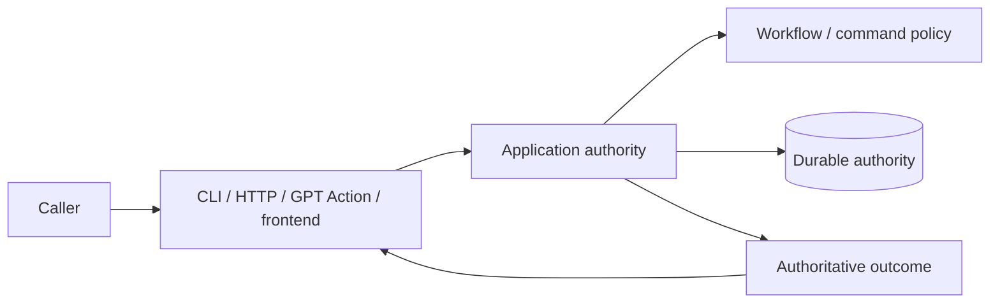

# Commands and surfaces

## Read this when

Read this when changing CLI, HTTP, GPT Action, admin, frontend command exposure, result guidance, or OpenAPI.

## Scope

This document separates command semantics from surface-specific behavior. It does not assume that transports are thin or logic-free.

## Authoritative implementation

Current anchors include `dish_service/cli.py`, `dish_service/admin_cli.py`, `dish_service/command_spec.py`, `dish_tool/admin_command_spec.py`, `dish_service/http_routing.py`, `dish_service/http.py`, `dish_service/auth.py`, `dish_service/openapi.py`, and application command handlers.

Current public GPT Action exposure is derived from `ACTION_COMMAND_DEFINITIONS` in the shared Action command specification and the generated Action schema. A command existing in CLI/application code does not by itself mean that the connected GPT can call it.

## Actors, processes, and stores

Agent CLI, admin CLI, GPT Action, and frontend are caller surfaces. They may expose overlapping capabilities with different authentication, presentation, or context.

## Authority and data ownership

Command specifications currently provide shared identity/exposure metadata. Workflow authority determines whether a consequential transition is legal. A surface decides how to expose, describe, collect arguments for, or present the authoritative result to its caller.

## Invariants

- A surface must not accidentally expose privileged/internal operations merely because a route or command exists elsewhere.
- Surface-specific guidance may add navigation, explanation, recovery instructions, or non-workflow affordances; it must not manufacture a workflow transition the backend considers legal when it is not.
- The public GPT Action transport may add `data.agent_guidance` derived from the canonical result. Guidance is contextual caller help, not workflow authority: it must not add or authorize legal actions, invent authoritative identifiers or state, or contradict `allowed_actions`.
- Command identity and replay classification should not be independently redefined in every surface.
- Overlapping capabilities across agent/admin/frontend surfaces are allowed when exposure and authorization are explicit.
- Do not claim that the deployed connected GPT can call a command solely because CLI/application code or source Action metadata supports it. Source exposure and deployed capability are distinct facts; deployed capability must be verified separately when making claims about the live surface.

## Process and transaction boundaries

Transport validation, normalization, capability handling, and response adaptation may occur before/after application execution. Those concerns do not confer workflow authority.

## Normal flow

A surface authenticates/validates its protocol, maps the request into a shared command/application call, receives an authoritative result, and renders caller-appropriate output.

For the connected GPT specifically, checked-in source capability and the deployed Action schema can differ temporarily. The current shared Action specification is the source-side exposure contract; deployment synchronization is an operational concern.

## Failure, replay, recovery, and concurrency

Mutation request identity/replay is handled by the shared replay mechanism. Surfaces may communicate recovery guidance but should not invent a second idempotency/retry identity model.

## Change routing

When adding a genuine backend command, update the shared command/application contract and whichever surfaces intentionally expose it. When changing only surface guidance or UX, it is legitimate to change only that surface if no backend semantic changes are required.

## Proving tests

Relevant current tests include `tests/test_action_surface.py`, `tests/test_action_surface_openapi.py`, `tests/test_transport.py`, and admin/Action contract tests. Prefer behavioral tests for behavioral guarantees. Structural tests are appropriate when structure itself enforces a security or authority boundary, but should not freeze incidental code layout.

## Current debt and temporary compatibility

The live connected-GPT schema and deployment can lag checked-in source schema; source capability and deployed capability are distinct operational facts. PostgreSQL command parity remains incomplete during migration.

## Related documents

- [Workflow and human review](workflow-and-human-review.md)
- [Request replay and idempotency](request-replay-and-idempotency.md)
- [System context](system-context.md)
