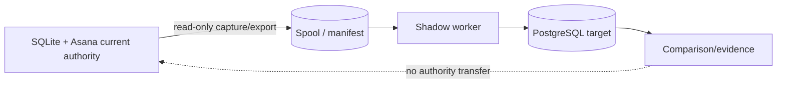

# Dark launch

## Read this when

Read this when changing production source capture, legacy export, spool delivery, shadow execution, comparison, readiness/status, or dark-launch isolation.

## Scope

Dark launch observes and exercises the PostgreSQL target without transferring live mutation authority.

## Authoritative implementation

Current anchors include `dish_pg/location_manifest.py`, `dish_pg/legacy_source.py`, `dish_pg/history_backfill.py`, `dish_pg/dark_launch_readiness.py`, `dish_pg/importer.py`, `dish_pg/import_runtime.py`, `dish_service/shadow_capture.py`, `dish_service/shadow_spool.py`, `dish_shadow/policy.py`, and `dish_pg/shadow_worker.py`.

## Actors, processes, and stores

## Authority and data ownership

Production capture is read-only observation. The location manifest/export/spool/comparison state is evidence. PostgreSQL shadow execution remains non-authoritative until explicit cutover. Readiness evidence is observation, not activation or mutation authority.

## Invariants

- Dark launch cannot create authority or transfer authority.
- Production source capture opens SQLite with `mode=ro`, uses the complete location manifest for the fixed production service environment, and cannot become a source mutation path.
- Production and TEST source identities/configuration must not silently mix or fall back into one another.
- Readiness/preflight uses a read-only transaction for database inspection and may inspect unit state with `systemctl show`; expected worker state remains disabled and inactive/stopped before activation. Readiness does not itself activate workers, enable production mutation, create command admission authority, or create a new import/spool/checkpoint authority.
- Shadow execution has no Asana I/O and shadow-origin work cannot project live effects, even if some other effect-enable/epoch configuration is incorrect or permissive.
- Treatment and comparison eligibility derive from current command metadata plus explicit shadow-only exceptions; there is no second complete hand-maintained treatment oracle.
- Captured/exported evidence remains bound to the source/environment/generation/corpus identities needed to interpret it; evidence from one identity must not silently certify another.
- A task imported from an `allow_open_operations` source may receive later terminal operation/cycle/lease history only through a separate immutable supplemental `ImportRun`; the bootstrap `ImportRun` remains unchanged. Supplemental application and candidate validation serialize on the active generation, and forward candidate manifests deterministically attest effective supplemental ImportRun provenance plus imported operation/cycle/lease history when such history exists.
- Evidence collection and successful comparison do not by themselves transfer authority.
- The PG-authoritative TEST comparator is not dark-launch synchronization: normal `/test` traffic goes only to PostgreSQL/no-Asana authority, while `/test-legacy` is a separately invoked disposable SQLite/Asana oracle. Comparator qualification must keep `dish-shadow-worker-test.service` stopped, must not mirror ordinary traffic, and must never copy oracle mutations into PostgreSQL.
- Comparator mismatches are durable qualification evidence only. The legacy oracle may be reset/reseeded when drift makes it unhelpful; it is never a failover target or a second TEST authority.
- TEST fixture-contamination recovery may roll the authority generation only through the dedicated TEST-only rollover transaction, and only when operator-supplied exact contaminated Stage 6 identities also match the persisted fixture-specific incident provenance; lifecycle state shape alone is never sufficient. Stable project/section/task identities and aliases stay in place, current generation-scoped task/registry authority is freshly materialized, the contaminated predecessor and all of its Stage 6/reservation/shadow evidence remain untouched, and the successor starts with no release/admission authority plus a fresh effects-disabled projection epoch and shadow baseline.
- Rollout ordering serializes work that can still execute (`pending`/`claimed` deliveries). A terminal
  `failed` delivery remains durable open-gap evidence but is not a baseline-wide cursor and must not
  block later comparison claims. Recovery of an earlier failed delivery is fenced while a later rollout
  evaluation is in flight or after a later command has produced a real comparison; later terminal
  failures and explicit skip/operator-void settlements do not by themselves make that retry unsafe.

## Process and transaction boundaries

Capture/export/readiness are observation paths. Shadow worker transactions may create target evidence, but origin isolation prevents external dispatch. Operational activation is separate from semantic command policy and from readiness observation.

## Normal flow

Capture current completed-command/source evidence read-only, bind it to its source identity, deliver it to the spool/target, execute eligible shadow commands, compare target outcomes against current authority, and surface mismatches/gaps for diagnosis.

## Failure, replay, recovery, and concurrency

Contradictory captured/current treatment or incompatible source/environment identity fails explicitly. Spool/worker claims are recoverable without making shadow execution authoritative. A delivery evaluation failure settles that envelope as `failed` plus an explicit `delivery_failure` gap while later rollout evidence remains claimable. Recovery may requeue the failed envelope only when no later rollout evaluation is currently claimed and no later rollout command has completed real evaluation; later failures that rolled back and explicit skip/operator-void settlements do not independently prevent recovery. Unavailable target infrastructure is reported as unavailable rather than silently bypassed.

## Change routing

Changes to capture/readiness must preserve read-only authority isolation. Changes to target command semantics belong to the PostgreSQL/application authority. Changes to comparison normalization belong to comparison evidence logic. Shadow execution must remain structurally incapable of dispatching live effects.

## Proving tests

Current evidence includes `tests/test_shadow_capture.py`, `tests/test_shadow_spool.py`, `tests/postgresql/test_location_manifest.py`, `tests/postgresql/test_dark_launch_legacy_source.py`, `tests/postgresql/test_dark_launch_readiness.py`, `tests/postgresql/test_dark_launch_policy.py`, `tests/postgresql/test_dark_launch_shadow_translation.py`, `tests/postgresql/native/test_importer.py`, and shadow-worker/authority regression tests.

## Current debt and temporary compatibility

Dark launch is migration machinery, not a permanent product subsystem. Its artifacts and controls should retire or simplify after PostgreSQL authority is established and migration evidence is no longer needed.

## Related documents

- [PostgreSQL runtime](postgresql-runtime.md)
- [External effects and Asana](external-effects-and-asana.md)
- [ADR-0001](decisions/0001-dark-launch-does-not-transfer-authority.md)
- [ADR-0004](decisions/0004-shadow-origin-never-projects.md)
- [ADR-0006 — how much dark-launch evidence cutover actually requires](decisions/0006-cutover-bar-matches-operating-context.md)
- Operating and investigating a live instance (status checks, log access, gap recovery, known
  non-bugs): [dark-launch runbook](../database-backend-dark-launch-runbook.md), "Investigating dark
  launch."
