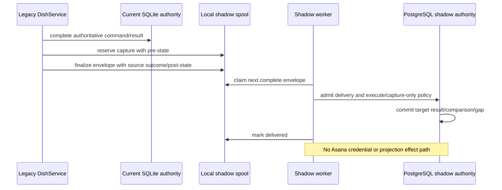

# Dark launch

## Read this when

Read this for legacy completion capture, production source-manifest capture, legacy export binding, spool durability/capacity, command treatment, shadow worker execution, parity comparison, gaps, rollout sequence, projection-effect isolation, production readiness preflight, status, or kill-switch behavior.

## Scope

This document owns the architecture and safety boundary of dark launch, including the read-only production source/readiness surfaces that must exist before host enablement. Exact enable/disable commands, host installation steps, and current rollout status remain in the dark-launch runbook and tracker.

## Authoritative implementation

- Command treatment derivation and shadow-only exceptions: `dish_shadow/policy.py`, reusing retained/query facts from `dish_pg/command_contract.py`.
- Legacy capture and source snapshots: `dish_service/shadow_capture.py`.
- Durable local spool and emergency gaps: `dish_service/shadow_spool.py`.
- Production/test source-location capture: `dish_pg/location_manifest.py`.
- Deterministic SQLite-plus-location-manifest export: `dish_pg/legacy_source.py`.
- Target shadow execution/comparison: `dish_pg/shadow_worker.py`, `dish_pg/shadow_evidence.py`.
- Shadow baseline/delivery/comparison/gap authority: `dish_pg/stage5_models.py`, `dish_pg/transition.py`.
- Status and kill-switch control: `dish_pg/dark_launch.py`, `dish_service/path_safety.py`.
- Production read-only readiness preflight: `dish_pg/dark_launch_readiness.py`.
- Operator entry points: `scripts/dish-pg-build-location-manifest`, `scripts/dish-pg-export-legacy`, `scripts/dish-pg-dark-launch-readiness`, `scripts/dish-pg-dark-launch`.
- Deployment contract: `deploy/systemd/dish-shadow-worker.service`, `deploy/systemd/dark-launch.env.example`.

## Actors, processes, and stores

The default legacy `dish-service` remains authority and writes the spool after a command outcome. The separate shadow worker claims complete spool records, translates source identities, executes against PostgreSQL, records comparison evidence, and marks delivery. It has no Asana call path. The shared filesystem kill switch disables new capture and worker progression.

Production source preparation is deliberately separate from shadow execution. `location_manifest.py` binds capture to the fixed production service identity, opens the production SQLite authority database read-only, and exposes only exact Asana task reads by GID. `legacy_source.py` performs no Asana calls: it reads SQLite content heads read-only and joins them to the separately captured location manifest. `dark_launch_readiness.py` is a fail-closed observation process over the prepared artifacts, existing spool, PostgreSQL target state, and installed stopped systemd unit; it is not an activation process.

## Authority and data ownership

The legacy result remains the request authority. Live title, notes, Cooking placement, and completion remain SQLite/Asana authority during dark launch. The production location manifest is a read-only observation of exact current task placement/completion, not a new writer or authority. The legacy export is deterministic importer input bound to SQLite content heads plus the complete location manifest; it does not replace either source authority.

Spool records own durable capture delivery state. PostgreSQL shadow baselines own envelopes, delivery, comparison, and gap evidence. Parity classes and counts are evaluation evidence, not production correctness or authority. Stage A command metadata supplies the default retained/query classification; `dish_shadow/policy.py` derives execute/excluded treatment from those facts and owns only the shadow-specific capture-only or target-gap exceptions. Comparison eligibility derives from that same treatment and is not a separate command list. Readiness reports are evidence output only; they do not create candidate, generation, baseline, epoch, spool, marker, import, credential, service-unit, or external-effect authority.

## Invariants

- Dark launch never changes current Asana/SQLite authority.
- Production source capture is bound to the fixed production service environment, production Cooking project identity, and production SQLite state root; TEST aliases, mixed identities, symlinked protected inputs, and credential ambiguity fail closed.
- The production SQLite corpus is read with SQLite URI `mode=ro`; location capture reads only task GIDs from `task_content_state` and requires a non-zero production corpus.
- The production Asana boundary exposes one operation only: exact task read by GID for the fields needed to bind membership/section/completion. It has no mutation surface and no retry-based ambiguity.
- `legacy_source.py` performs no Asana I/O and exports only when the location-manifest task set exactly equals the SQLite content-head corpus.
- Production readiness is strictly read-only. PostgreSQL inspection starts an explicit read-only transaction and always rolls it back; the existing spool is opened read-only and rejected if inspection creates SQLite sidecars or changes its identity.
- systemd readiness inspection uses `systemctl show` only. The worker must be loaded from the expected unit bytes, disabled and inactive/stopped, use exactly the expected environment file, and have no drop-ins, inline environment, or `PassEnvironment` leakage.
- Readiness/preflight may write only an explicitly requested report artifact; it cannot create authority, spool/checkpoint state, imports, markers, unit changes, external effects, or credential-bearing output.
- Service, worker, spool, kill-switch, evidence, and TEST paths must remain isolated; production configuration may not alias TEST state or protected source/credential files.
- Capture failure is fail-open for the already-completed legacy command but must create logs/emergency gap evidence where possible.
- `create`, proposal application/review, and target-specific projection recovery remain capture-only until their target semantics are qualified.
- Commands omitted from the Stage A target contract may appear in dark launch only as explicit shadow-only exceptions tied to a current Action/admin identity; they do not become target command authority by appearing in shadow policy.
- Read-only/retired commands may be excluded explicitly; unregistered commands are not silently treated as parity evidence.
- A captured treatment that contradicts the current derived treatment is a reported delivery failure, never a silent choice of the captured or current value.
- Shadow projection epochs are effects-disabled.
- Outbox rows carry immutable `origin`; projection workers reject `origin=shadow` independently of epoch configuration.
- The kill switch stops both new capture and worker execution/drain.
- Baseline closure cannot pass admitted deliveries or open gaps.

## Process and transaction boundaries

Capture surrounds the legacy call with source snapshots but does not own the command transaction. Spool reservation/finalization is independent and bounded. The worker opens PostgreSQL transactions for delivery admission, target execution, and comparison, and uses spool claim/reservation timeouts for restart recovery.

Production preparation is an observation pipeline, not a transaction spanning systems: location capture reads the fixed SQLite corpus and then exact Asana tasks; export later joins that manifest to read-only SQLite content heads; readiness independently rereads artifact identities, existing spool/checkpoint state, target PostgreSQL authority in a rolled-back read-only transaction, and the stopped unit. A failure at any boundary blocks readiness without mutating the inspected system.

## Normal flow

1. Capture the production location manifest only through the fixed production identity and read-only SQLite/Asana boundaries.
2. Export deterministic legacy importer input from SQLite content heads plus that complete manifest; no Asana access occurs in export.
3. Prepare/import the target generation, baseline, epoch, and an existing checkpointed spool through their owning tools.
4. Run the read-only readiness preflight to verify service/worker environment isolation, artifact identity linkage, spool/checkpoint health, PostgreSQL generation/import/baseline/epoch state, kill switch, and installed stopped worker unit.
5. During enabled capture, check mode, kill switch, command treatment, and spool availability.
6. Reserve a source identity and capture authoritative pre-state.
7. Run the normal legacy command unchanged.
8. Capture result/post-state and finalize the spool record or record a gap.
9. Worker claims the earliest deliverable record.
10. Translate stable source identifiers into shadow target identifiers.
11. Execute the target command when eligible or record capture-only evidence.
12. Normalize/compare source and target outcomes and settle delivery.
13. Status reports bounded backlog/lag/capacity, parity/mismatch/gap counts, kill-switch/worker state, and threshold health without changing capture or worker state.

## Failure, replay, recovery, and concurrency

An earlier unresolved spool reservation blocks later delivery ordering. Claimed records are recoverable after reservation expiry. Spool capacity can engage the kill switch. Identity translation requires a unique prior binding and otherwise records a gap/mismatch rather than guessing. Worker restart reclaims durable delivery state. Disablement must not affect the live service result path.

Production source/readiness failures are fail-closed: corpus mismatch, changed artifact identity, path aliasing, wrong environment/project/database, ambiguous credentials, a mutable or capacity-breached spool, divergent PostgreSQL identity/schema/head, or a worker unit that is active, enabled, altered, drop-in modified, or environment-leaky blocks the preflight. Such a failure is evidence about readiness only; it does not repair or advance any authority automatically.

## Change routing

- Change retained/query command facts in their command-metadata owner. Change only genuinely shadow-specific treatment exceptions in `dish_shadow/policy.py`; comparison eligibility follows that treatment automatically.
- Change capture snapshots/spool records in `shadow_capture.py`/`shadow_spool.py` and migration-safe spool tests.
- Change fixed production source identity, read-only SQLite/Asana capture, or output-path protection in `dish_pg/location_manifest.py`; do not put production Asana reads into `legacy_source.py`.
- Change importer-source binding in `dish_pg/legacy_source.py`; preserve exact corpus equality with the location manifest.
- Change readiness observation/gates in `dish_pg/dark_launch_readiness.py` and the systemd/environment contract together; do not turn preflight into an installer, repair tool, or authority creator.
- Change target semantics in PostgreSQL command/workflow services, not the shadow worker.
- Change comparison normalization in `shadow_evidence.py` with versioned evidence.
- Never add Asana credentials, adapter imports, or projection-worker calls to `shadow_worker.py`.

## Proving tests

- `tests/test_shadow_capture.py` and `tests/test_shadow_spool.py` prove legacy capture/spool behavior.
- `tests/postgresql/test_location_manifest.py` and `tests/postgresql/test_location_manifest_filesystem_safety.py` prove fixed-environment, read-only source capture and filesystem isolation.
- `tests/postgresql/test_dark_launch_legacy_source.py` proves deterministic SQLite-plus-manifest export and no source-corpus drift.
- `tests/postgresql/test_dark_launch_readiness.py`, `tests/postgresql/test_dark_launch_readiness_authority.py`, `tests/postgresql/test_dark_launch_readiness_report.py`, and `tests/postgresql/test_dark_launch_readiness_systemd.py` prove fail-closed read-only preflight, authority non-creation, redacted reporting, and stopped-unit inspection.
- `tests/postgresql/test_dark_launch_status.py` proves status is a bounded read-only observation surface.
- `tests/postgresql/test_dark_launch_policy.py` proves the independent treatment/eligibility inventory, metadata derivation, and shadow-origin effect rejection.
- `tests/postgresql/test_dark_launch_shadow_worker.py` and `tests/postgresql/test_dark_launch_shadow_translation.py` prove worker execution/identity mapping.
- `tests/postgresql/test_dark_launch_authority_regressions.py` proves authority does not transfer.
- `tests/postgresql/test_shadow_delivery_authority.py` proves delivery/baseline ordering.
- `tests/postgresql/test_dark_launch_test_acceptance.py` proves the TEST acceptance sequence without standing in for production readiness.

## Current debt and temporary compatibility

Repository production-readiness surfaces are implemented, but live host preflight, installation/runtime rehearsal, enablement, and production evidence are operational state rather than architecture facts. The current status belongs in `../database-backend-dark-launch.md`, `../database-backend-dark-launch-runbook.md`, and `../ops-issues.md`; do not promote a fixture report or repository implementation into a production-ready claim here. Some commands are intentionally capture-only. Dark launch is temporary rollout evidence and should disappear or narrow after successful cutover and evidence-retention decisions.

## Related documents

- [PostgreSQL runtime](postgresql-runtime.md)
- [External effects and Asana](external-effects-and-asana.md)
- [Authority and data ownership](authority-and-data-ownership.md)
- [ADR-0001](decisions/0001-dark-launch-does-not-transfer-authority.md)
- [ADR-0004](decisions/0004-shadow-origin-never-projects.md)
- [`../database-backend-dark-launch.md`](../database-backend-dark-launch.md)
- [`../database-backend-dark-launch-runbook.md`](../database-backend-dark-launch-runbook.md)
- [`../ops-issues.md`](../ops-issues.md)
