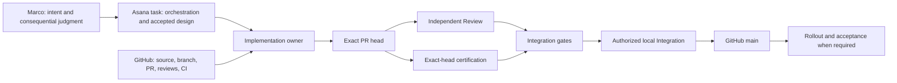

# Development Workflow architecture

This is a routed sub-index of the single canonical [Dish architecture knowledge base](../index.md). It describes the current accepted development system; it is not a second architecture authority or an operating runbook.

## One-page system overview

## Current authority summary

| Concern | Current authority |
|---|---|
| Repository source, history, branches, PRs, formal reviews, and CI | GitHub |
| Development task state, accepted design, decisions, and orchestration | Owning Asana project/task under its repository-owned project contract |
| Product/runtime behavior actually deployed | Direct environment evidence |
| Role permissions and lifecycle invariants | Repository standing contracts and accepted ADRs |
| Routine PR state classification and routing | Manual, by the acting role from fresh GitHub/Asana reads and the standing contracts |

## Start here for…

| Topic | Document |
|---|---|
| Actors, systems, and trust/capability boundaries | [System context](system-context.md) |
| Which facts live where and how contradictions reconcile | [Authority and state](authority-and-state.md) |
| End-to-end development phases | [Lifecycle](lifecycle.md) |
| Task, branch, PR, head, worktree, claim, and concurrency identity | [Work identity and concurrency](work-identity-and-concurrency.md) |
| Design/Code Review, CI, certification, and local Integration | [Review, certification, and Integration](review-certification-integration.md) |
| ChatGPT, Claude, Codex, Worker, and Marco interaction | [Execution hosts and operator boundary](execution-hosts-and-operator-boundary.md) |
| Restart, ambiguous outcomes, observability, rollout, and completion | [Recovery, observability, and completion](recovery-observability-and-completion.md) |
| How to evolve the development system without competing machinery | [Extension rules](extension-rules.md) |
| Consequential settled choices | [Development Workflow decisions](decisions/index.md) |

## Task-to-document routing

Read only the relevant routed documents after this index. A change that alters an authority, lifecycle, identity, concurrency, recovery, evidence, operator, execution-host, or completion boundary updates the owning architecture document in the same PR by default. An implementation-local refactor that preserves those boundaries does not churn architecture prose.

| Change | Usually relevant |
|---|---|
| Lifecycle phase or manual classification | [Lifecycle](lifecycle.md), [Authority and state](authority-and-state.md) |
| Branch/worktree ownership, takeover, stack or concurrency mechanics | [Work identity and concurrency](work-identity-and-concurrency.md) |
| Review, exact-head CI, certification, or merge admission | [Review, certification, and Integration](review-certification-integration.md) |
| Host routing, local-only classification, relay, or operator attention | [Execution hosts and operator boundary](execution-hosts-and-operator-boundary.md) |
| Restart, reconciliation, cleanup, visibility, rollout, or terminal state | [Recovery, observability, and completion](recovery-observability-and-completion.md) |
| New authority, queue, service, database, or persistent mechanism | [Extension rules](extension-rules.md) and applicable ADRs |

## Authoritative-code and runbook map

| Concern | Current anchor |
|---|---|
| PR lifecycle classification/routing | [Lifecycle](lifecycle.md) and the acting [standing role](../../agents/index.md) |
| Review/Integration predicates | [`../../../../scripts/pr_gate.py`](../../../../scripts/pr_gate.py) |
| Local Implementation worktrees and claims | [`../../../../tools/agent-worktree`](../../../../tools/agent-worktree) |
| Local Integration procedure | [`../../agents/integration.md#Manual Integration handoff`](../../agents/integration.md#manual-integration-handoff) |
| Test selection/planning | [`../../testing.md`](../../testing.md), [`../../../scripts/dish-test-plan`](../../../scripts/dish-test-plan) |
| Historical, never-activated dispatcher design | [`../../../../ci/pr-lifecycle-dispatcher-runbook.md`](../../../../ci/pr-lifecycle-dispatcher-runbook.md) |
| Standing role authority | [`../../agents/index.md`](../../agents/index.md) |
| Operator presentation/orchestration mechanics | [`../../../../OPERATOR_CONTROL_PLANE.md`](../../../../OPERATOR_CONTROL_PLANE.md) |

## Document status and ownership

These documents record current landed architecture and accepted ADRs. Standing role contracts own what an actor may do; runbooks own commands; Asana owns live work and proposed designs until they land; code/tests own executable behavior and evidence.

## Architecture decisions

- [Authority is split by fact](decisions/0001-authority-is-split-by-fact.md)
- [Durable PR and exact-head lifecycle](decisions/0002-durable-pr-exact-head-lifecycle.md)
- [Unactivated lifecycle dispatcher design](decisions/0003-single-restartable-lifecycle-dispatcher.md)
- [Lifecycle phases remain distinct](decisions/0004-phases-remain-distinct.md)
- [Capability-grounded execution](decisions/0005-capability-grounded-execution.md)

## Related documents

- [Canonical architecture index](../index.md)
- [Design principles](../../agents/design-principles.md)
- [Testing boundaries](../testing-boundaries.md)
