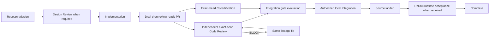

# Development Workflow lifecycle

## Read this when

Read this when changing phase boundaries, lifecycle classification, handoff ordering, or completion semantics.

## Scope

This is the current lifecycle model, not an operating checklist. Role contracts and runbooks own action-level procedure.

## Current architecture

Research/design becomes Implementation-ready only when its required decisions and pre-development review are durably satisfied. Implementation owns one task/branch lineage, publishes a real PR, finishes scoped evidence, and explicitly moves the PR from draft to review-ready. Review and ordinary exact-head CI may then proceed independently; pending CI is not a reason to delay semantic Review. A formal MERGE verdict begins gate evaluation rather than completing the task.

Integration uses the exact reviewed candidate and performs only authorized mechanical reconciliation. A changed head returns to fresh Review. Source landing is distinct from deployment, migration, activation, or operator acceptance; a task becomes complete only after its actual residual obligations are done.

### Explicit per-change lifecycle shortcuts

The normal lifecycle above remains the default. [`trivial-fast-track.md`](../../agents/trivial-fast-track.md) defines one narrow capability-based exception when Marco explicitly authorizes the exact change and that grant has been durably bound to task, owned branch, current-main base, exact path set, and Marco's exact words. This is not another lifecycle state machine or ownership system.

- `TRIVIAL` uses the existing isolated worktree/claim/commit primitives, requires one bounded commit from the recorded current-main base, and may non-force fast-forward `main` directly after guarded readback. For that exact authorized change only, PR, formal Review, and separate Integration are omitted.
- `FAST-TRACK` still publishes the owned branch and PR normally. Formal Review is omitted only when the exact durable grant says `skip_review=true`; final Integration remains separately authorized. The exact grant also records the risk-selected validation class: meaningful readback when executable tests add no evidence, or focused executable proof for product/runtime and comparable high-consequence behavior before landing.
- Missing/stale authorization, base movement, primary-checkout use, path escape, or ambiguity invalidates either shortcut and returns the work to the full normal lifecycle. `TRIVIAL` additionally rejects protected/high-consequence scope. `FAST-TRACK` may cover executable/high-consequence scope only when the exact grant selects focused `executable-proof` and that proof is obtained before landing.

## Invariants

- Each semantic task retains its own commit/PR/task lineage even in an ordered stack.
- Review BLOCK fixes stay on the existing task/PR lineage.
- A successor head never inherits an older exact-head verdict silently.
- CI ownership is classified before a failing candidate is modified.
- Post-merge gates remain in their real phase and do not become source-merge blockers by proximity.
- Detailed GitHub substates are not duplicated as an Asana lifecycle system.
- Per-change shortcut capability is exact and fail-closed; it never becomes a standing agent-owned waiver.

## Current anchors

- [`../../agents/implementation.md`](../../agents/implementation.md)
- [`../../agents/review.md`](../../agents/review.md)
- [`../../agents/integration.md`](../../agents/integration.md)
- [`../../agents/development-workflow.md`](../../agents/development-workflow.md)
- [`../../../../scripts/pr_gate.py`](../../../../scripts/pr_gate.py)

## Related documents

- [Review, certification, and Integration](review-certification-integration.md)
- [Recovery, observability, and completion](recovery-observability-and-completion.md)
- [ADR 0002](decisions/0002-durable-pr-exact-head-lifecycle.md)
- [ADR 0004](decisions/0004-phases-remain-distinct.md)
