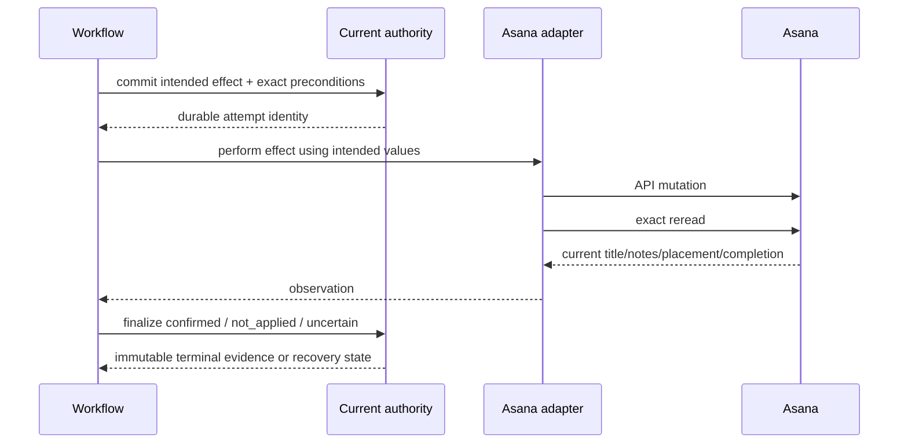

# External effects and Asana

## Read this when

Read this for task creation, title/notes writes, section moves, completion, Asana SDK behavior, lost responses, uncertain effects, destination repair, projection outbox work, or reconciliation.

## Scope

This document owns the exact external-effect protocol and the boundary between authoritative local intent and external Asana observation. It does not own workflow legality or operator commands.

## Authoritative implementation

- Exact current gateway: `dish_tool/task_gateway.py`.
- External effect use cases: `dish_tool/task_store.py`, `dish_tool/backend.py`.
- Attempt persistence/finalization: `dish_tool/database.py`, `dish_tool/recovery.py`.
- Submission/destination handling: `dish_tool/step9.py`, `dish_tool/submission_authority.py`.
- Asana generic-write guard: `dish_tool/generic_asana_guard.py`.
- PostgreSQL projection model/service: `dish_pg/stage5_models.py`, `dish_pg/transition.py`.
- Projection worker and reconciliation: `dish_pg/projection_worker.py`, `dish_pg/reconciliation_worker.py`.

## Actors, processes, and stores

The default service process calls Asana through `AsanaBackend`. SQLite stores intended writes/movements, exact preconditions, and terminal evidence. In the PostgreSQL target, authoritative commands create ordered projection outbox events; a separate projection worker performs Asana effects and a reconciliation worker compares complete external corpus state.

## Authority and data ownership

Asana currently owns live content and placement. SQLite owns why an effect was attempted, the exact expected identity/section, and whether reread proves `confirmed`, `not_applied`, or `uncertain`. After cutover, PostgreSQL would own task state and Asana would become a projection; outbox attempts/observations/adjudications would own effect evidence.

## Invariants

- Persist immutable intent before calling Asana.
- Select placement by exact Cooking project GID, never first membership.
- Reread before and after every governed write/move; an SDK return value alone is insufficient.
- Every effect has one evidence-backed outcome: `confirmed`, `not_applied`, or `uncertain`.
- `not_applied` requires proof that the intended effect did not occur; a return to baseline is insufficient without certified ABA behavior.
- Uncertain effects target their original immutable intent and are reconciled, not blindly retried.
- A confirmed success remains success even if later cleanup/reporting fails.
- Shadow-origin PostgreSQL work never reaches the Asana adapter.

## Process and transaction boundaries

The network call is outside the local database transaction. Intent commits before the call; terminal adjudication commits after reread. In PostgreSQL, outbox admission is in the authoritative command transaction, while claim, dispatch-attempt creation, adapter call, observation, and adjudication are separate recoverable steps.

## Normal flow

1. Read the exact live task and compute content identity/placement.
2. Validate it against the operation baseline and current workflow snapshot.
3. Commit an intended write/movement attempt.
4. Call Asana using the generated SDK boundary.
5. Reread the task by exact project identity.
6. Finalize the attempt and any workflow step based on evidence.
7. For PostgreSQL projection, preserve task ordering and mapping identity through outbox events and attempts.

## Failure, replay, recovery, and concurrency

A lost network response can mean the effect happened. Recovery compares exact current state with recorded intent and baseline. Destination failures preserve successful signed content and expose repair/retry guidance without reversing signoff. PostgreSQL dispatch attempts are immutable: after claim expiry, recovery observes using the original dispatch identity and never sends the same dispatch again. Uncertain or blocked projection work prevents later events for that task.

## Change routing

- Change Asana API mechanics in `dish_tool/backend.py`; preserve the gateway contract.
- Change exact read/write/move semantics in `task_gateway.py`/`task_store.py` and attempt persistence together.
- Change workflow response to an effect outcome in the owning stage module, not the adapter.
- Change target projection semantics in `dish_pg/transition.py` and worker tests; workers must not reimplement claim/adjudication logic.
- Do not use the generic Asana CLI/helper to mutate governed Cooking tasks.

## Proving tests

- `tests/test_asana_placement_lifecycle.py` proves exact project/section behavior.
- `tests/test_backend_effect_recovery_resilience.py` and `tests/test_backend_service_resilience.py` prove effect recovery.
- `tests/test_consequential_response_loss.py` proves lost-response handling.
- `tests/test_support_asana_backend.py` and generated SDK contract tests prove the real SDK boundary.
- `tests/postgresql/test_projection_attempt_lifecycle.py`, `tests/postgresql/test_projection_recovery_lifecycle.py`, and native projection-worker tests prove target attempt semantics.
- `tests/postgresql/test_reconciliation_worker.py` proves corpus reconciliation boundaries.

## Current debt and temporary compatibility

The current system cannot atomically commit SQLite workflow state and Asana effects. That is why intent/observation/adjudication evidence is required. Pre-cutover PostgreSQL `create` remains capture-only until exact lost-response correlation is proven. Post-cutover projection worker deployment is implemented in code but not yet the production topology.

## Related documents

- [Authority and data ownership](authority-and-data-ownership.md)
- [Request replay and idempotency](request-replay-and-idempotency.md)
- [Dark launch](dark-launch.md)
- [ADR-0004](decisions/0004-shadow-origin-never-projects.md)
