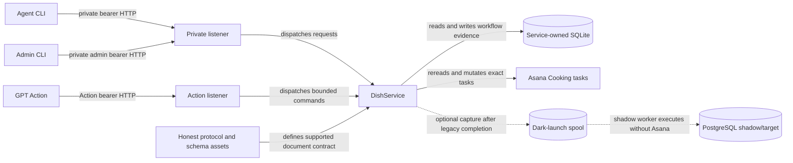

# Dish architecture knowledge base

Dish is the guarded mutation system for protocol-governed Cooking tasks. This index is the canonical architecture entry point for maintainers and fresh coding agents.

> **Runbooks describe operations; architecture documents describe ownership and invariants. A command appearing in a runbook does not make that runbook the authority for the behavior.**

## One-page system overview

The current production path is the default `dish-service` runtime. It owns the writable SQLite database, Asana credential, service request replay, leases, workflow execution claims, recovery, and the private and Action HTTP listeners. The live Asana task remains authoritative for current task title, notes, Cooking-project placement, and externally observed completion. SQLite owns workflow intent and evidence. Current Honest protocol and schema assets own the supported document contract.

PostgreSQL is a separately implemented target under `dish_pg/`. The checked-in service can expose it only through `dish-service --postgresql-test-runtime`, which requires the TEST profile, a disposable `dish_*_test` database, and an environment with no reachable Asana configuration. Dark launch mirrors completed legacy commands into a local spool and then into non-authoritative PostgreSQL shadow execution. It does not transfer authority and shadow-origin work cannot reach Asana.

## Current authority summary

| Fact | Current authority | Important derived or future state |
|---|---|---|
| Supported task-document contract | Honest assets resolved by `dish_tool/releases.py` | Parsed and validated document objects are derived. |
| Live title, notes, Cooking placement, completion | Exact Asana reread through `dish_tool/task_gateway.py` and `dish_tool/backend.py` | SQLite stores identities and effect evidence, not a replacement live document. |
| Workflow intent, operations, verification, holds, leases, replay, recovery, audit | Service-owned SQLite through `dish_tool/database_schema.py`, `dish_tool/database.py`, and service coordinators | `dish_pg/` models the intended post-cutover authority but is not production authority. |
| Legal current actions | `dish_tool/application_service.py` snapshot plus `dish_tool/workflow_policy.py` | Persisted phase candidates and rendered `allowed_actions` are projections. |
| HTTP route recognition and credential scope | `dish_service/http_routing.py`, `dish_service/http.py`, and `dish_service/auth.py` | OpenAPI is generated from the shared command contract. |
| Dark-launch source/capture/readiness | `dish_pg/location_manifest.py`, `dish_pg/legacy_source.py`, `dish_service/shadow_spool.py`, `dish_pg/dark_launch_readiness.py`, `dish_shadow/policy.py` | Production capture/preflight are read-only evidence surfaces; spool/comparison state is not live authority. |
| PostgreSQL cutover admission and release evidence | `dish_pg/stage6_models.py`, `dish_pg/release.py`, and `dish_pg/cutover_control.py` | Authority changes only after explicit activation, fencing, rollback-burn, and admission evidence. |

## Start here for…

| Task | Read first |
|---|---|
| Commands, CLI, HTTP, Action, or OpenAPI | [Commands and surfaces](commands-and-surfaces.md) |
| Workflow transitions, verification, holds, Human Review, or abandonment | [Workflow and human review](workflow-and-human-review.md) |
| Request IDs, lost responses, retries, restore replay, or idempotency | [Request replay and idempotency](request-replay-and-idempotency.md) |
| Process locks, service leases, execution claims, stale workers, or writer fences | [Operations, leases, and fencing](operations-leases-and-fencing.md) |
| Asana writes, movement, exact rereads, uncertain effects, or projection attempts | [External effects and Asana](external-effects-and-asana.md) |
| PostgreSQL models, transactions, validation replay, reconciliation, workers, migrations, release controls, or cutover | [PostgreSQL runtime](postgresql-runtime.md) |
| Dark-launch production manifest/export, readiness preflight, capture, spool, worker, comparison, gaps, status, or kill switch | [Dark launch](dark-launch.md) |
| Test selection, governed lanes, native PostgreSQL, PGlite, or proof boundaries | [Testing boundaries](testing-boundaries.md) |
| Where a new rule or module belongs | [Extension rules](extension-rules.md) |
| Overall processes, stores, and trust boundaries | [System context](system-context.md) |
| Which component owns a durable fact | [Authority and data ownership](authority-and-data-ownership.md) |
| Package layering and dependency direction | [Packages and dependencies](packages-and-dependencies.md) |

## Task-to-document routing

| Change request | Required architecture reading | Operational or product companion |
|---|---|---|
| Add or change an agent command | [Commands and surfaces](commands-and-surfaces.md), [Workflow and human review](workflow-and-human-review.md), [Request replay](request-replay-and-idempotency.md) | [`../runtime-contract.md`](../runtime-contract.md) |
| Change task content or placement effects | [External effects and Asana](external-effects-and-asana.md), [Authority and data ownership](authority-and-data-ownership.md) | [`../runtime-contract.md`](../runtime-contract.md) |
| Add an admin continuation or hold route | [Workflow and human review](workflow-and-human-review.md), [Commands and surfaces](commands-and-surfaces.md), [Operations, leases, and fencing](operations-leases-and-fencing.md) | [`../workflow.md`](../workflow.md) for approved future product behavior |
| Change SQLite schema, startup, backup, or restore | [Authority and data ownership](authority-and-data-ownership.md), [Request replay](request-replay-and-idempotency.md), [Operations, leases, and fencing](operations-leases-and-fencing.md) | [`../runtime-contract.md`](../runtime-contract.md), [`../testing.md`](../testing.md) |
| Change PostgreSQL ORM, migrations, command port, or workers | [PostgreSQL runtime](postgresql-runtime.md), [Testing boundaries](testing-boundaries.md) | [`../database-backend.md`](../database-backend.md), [`../database-backend-migration.md`](../database-backend-migration.md) |
| Change dark launch | [Dark launch](dark-launch.md), [External effects and Asana](external-effects-and-asana.md), [PostgreSQL runtime](postgresql-runtime.md) | [`../database-backend-dark-launch-runbook.md`](../database-backend-dark-launch-runbook.md) |
| Change test policy or selector ownership | [Testing boundaries](testing-boundaries.md), [Extension rules](extension-rules.md) | [`../testing.md`](../testing.md) |
| Change deployable topology or credentials | [System context](system-context.md), [Commands and surfaces](commands-and-surfaces.md) | [`../../README.md`](../../README.md), [`../../deploy/gpt-action.md`](../../deploy/gpt-action.md) |

## Subsystem-to-authoritative-code map

| Subsystem | Authoritative code |
|---|---|
| Agent and admin CLI parsing | `dish_tool/cli.py`, `dish_tool/admin_cli.py` |
| Shared command specifications | `dish_service/command_spec.py`, `dish_tool/admin_command_spec.py`, `dish_pg/command_contract.py` |
| HTTP and authentication | `dish_service/http.py`, `dish_service/http_routing.py`, `dish_service/auth.py`, `dish_service/openapi.py` |
| Service composition and request lifecycle | `dish_service/application.py`, `dish_service/request_coordinators.py`, `dish_service/lease_requests.py` |
| Current action authority | `dish_tool/application_service.py`, `dish_tool/workflow_policy.py` |
| Current workflow use cases | `dish_tool/step5.py` through `dish_tool/step9.py` plus named domain helpers |
| SQLite schema and persistence | `dish_tool/database_schema.py`, `dish_tool/database_initialization.py`, `dish_tool/database.py`, `dish_tool/transactions.py` |
| Exact Asana boundary | `dish_tool/task_gateway.py`, `dish_tool/task_store.py`, `dish_tool/backend.py` |
| Request replay | `dish_service/request_replay.py`, `dish_service/request_coordinators.py`, `dish_pg/workflow.py`, `dish_pg/postgres_service.py` |
| Leases and execution claims | `dish_service/leases.py`, `dish_service/lease_requests.py`, `dish_tool/operation_execution.py` |
| Backup and restore | `dish_service/backup.py`, `dish_service/backup_creation_journal.py`, `dish_service/restore_plan.py`, `dish_service/restore_request_journal.py` |
| Dark-launch source capture/export/readiness | `dish_pg/location_manifest.py`, `dish_pg/legacy_source.py`, `dish_pg/dark_launch_readiness.py` |
| Dark-launch command capture and spool | `dish_service/shadow_capture.py`, `dish_service/shadow_spool.py`, `dish_shadow/policy.py` |
| PostgreSQL authority model and command port | `dish_pg/models.py`, `dish_pg/stage3_models.py`, `dish_pg/stage5_models.py`, `dish_pg/stage6_models.py`, `dish_pg/command_port.py` |
| PostgreSQL projection/reconciliation authority and workers | `dish_pg/transition.py`, `dish_pg/projection_worker.py`, `dish_pg/reconciliation_worker.py`, `dish_pg/shadow_worker.py` |
| PostgreSQL release and cutover controls | `dish_pg/release.py`, `dish_pg/release_evidence.py`, `dish_pg/release_status.py`, `dish_pg/cutover_control.py` |
| Test selection | `test_selection/ownership.csv`, `test_selection/planner.py`, `test_selection/validator.py` |

## Document status and ownership

Every document below describes current implemented behavior unless its debt section explicitly labels intended or temporary behavior. Code and proving tests are the authority; no document owns runtime behavior by itself.

| Document | Owns | Status |
|---|---|---|
| [System context](system-context.md) | Processes, stores, trust boundaries, deployment shapes | Current |
| [Authority and data ownership](authority-and-data-ownership.md) | Writer/reader ownership and authoritative-versus-derived facts | Current |
| [Packages and dependencies](packages-and-dependencies.md) | Package boundaries and dependency direction | Current |
| [Commands and surfaces](commands-and-surfaces.md) | CLI/HTTP/Action/admin command surfaces | Current |
| [Workflow and human review](workflow-and-human-review.md) | Current workflow policy, verification, holds, proposals, abandonment | Current |
| [Request replay and idempotency](request-replay-and-idempotency.md) | Request identity, result replay, lost-response handling | Current |
| [Operations, leases, and fencing](operations-leases-and-fencing.md) | Process, lease, claim, admission, and writer fences | Current |
| [External effects and Asana](external-effects-and-asana.md) | Exact external-effect protocol and projection lifecycle | Current |
| [PostgreSQL runtime](postgresql-runtime.md) | Implemented target runtime and cutover authority | Current; not production authority |
| [Dark launch](dark-launch.md) | Capture, spool, shadow execution, comparison, safety isolation | Current; host enablement remains operationally gated |
| [Testing boundaries](testing-boundaries.md) | Test evidence and lane ownership | Current |
| [Extension rules](extension-rules.md) | Change routing and compatibility limits | Current |
| [Architecture decisions](decisions/index.md) | Small records of settled, repeatedly reopened decisions | Current |
| [ADR-0001](decisions/0001-dark-launch-does-not-transfer-authority.md) | Dark-launch authority | Accepted |
| [ADR-0002](decisions/0002-request-identity-is-permanent.md) | Request identity permanence | Accepted |
| [ADR-0003](decisions/0003-approval-and-application-are-separate.md) | Proposal approval/application separation | Accepted |
| [ADR-0004](decisions/0004-shadow-origin-never-projects.md) | Shadow-origin effect isolation | Accepted |
| [ADR-0005](decisions/0005-cutover-evidence-is-bounded.md) | Bounded cutover evidence | Accepted |

## Runbooks, product decisions, and active plans

These are linked rather than duplicated:

- Operations and service use: [`../../README.md`](../../README.md), [`../runtime-contract.md`](../runtime-contract.md), [`../ops.md`](../ops.md).
- Testing operations: [`../testing.md`](../testing.md).
- Dark-launch procedure and current host gate: [`../database-backend-dark-launch-runbook.md`](../database-backend-dark-launch-runbook.md), [`../database-backend-dark-launch.md`](../database-backend-dark-launch.md).
- Approved PostgreSQL product architecture: [`../database-backend.md`](../database-backend.md), [`../postgresql-cutover.md`](../postgresql-cutover.md).
- Remaining PostgreSQL work and evidence: [`../database-backend-imp.md`](../database-backend-imp.md), [`../database-backend-postgresql-test-plan.md`](../database-backend-postgresql-test-plan.md), [`../postgresql-cutover-imp.md`](../postgresql-cutover-imp.md), [`../ops-issues.md`](../ops-issues.md).
- Release/cutover procedure: [`../database-backend-stage6-runbook.md`](../database-backend-stage6-runbook.md).
- Future product work: [`../future.md`](../future.md), [`../workflow.md`](../workflow.md), [`../known-issues.md`](../known-issues.md).
