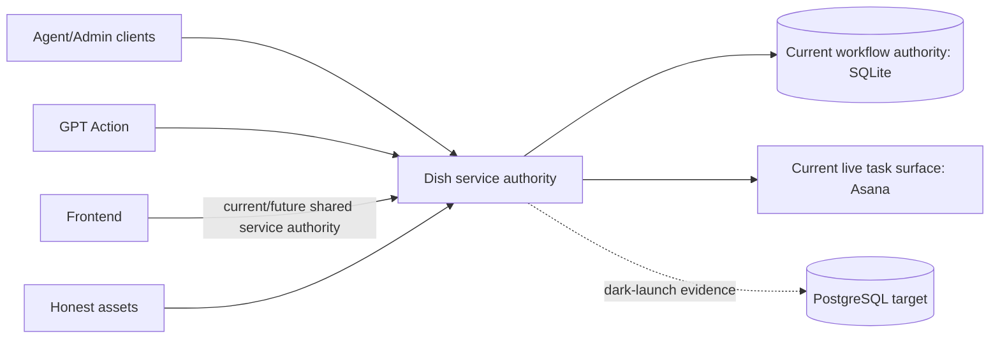

# Dish architecture knowledge base

This directory describes the system's durable boundaries, authorities, safety invariants, major runtime/data flows, and consequential design decisions. It is intentionally not a coding handbook.

> **Runbooks describe operations; architecture documents describe ownership and invariants.** Implementation files are named as current anchors, not permanent extension points.

## One-page system overview

Dish currently coordinates protocol-governed Cooking tasks through one service authority. The service accepts authenticated CLI/admin/GPT Action requests, persists workflow and recovery evidence in SQLite, and performs governed effects against Asana. Honest protocol/schema assets define the task-document contract.

PostgreSQL is the replacement authority under development. During dark launch it receives imported/shadow evidence but does not become live authority. Asana is also transitional: once the frontend sufficiently replaces its user-facing role and the backend is reliable enough, Asana is intended to retire rather than remain a permanent architectural dependency.

## Current authority summary

| Concern | Current authority | Direction |
|---|---|---|
| Supported task-document contract | Honest assets resolved by `dish_tool/releases.py` | Stable contract source |
| Live task content/placement/completion | Exact Asana reads/writes coordinated by Dish | Transitional; intended to retire after frontend/backend replacement |
| Workflow intent, operations, replay, leases, audit | Service-owned SQLite | Intended to move to PostgreSQL |
| Legal workflow actions | `dish_tool/workflow_policy.py` over authoritative state facts | Consumers may adapt/present but not independently authorize transitions |
| Command/surface contract | Shared command specifications plus transport/auth rules | Multiple surfaces may expose overlapping capabilities explicitly |
| PostgreSQL target state | `dish_pg/` | Non-authoritative before cutover; canonical after explicit cutover |
| Dark-launch evidence | Capture/spool/shadow/reconciliation stores | Evidence only; never current authority |

## Start here for…

| Topic | Document |
|---|---|
| Processes, trust boundaries, frontend/Asana direction | [System context](system-context.md) |
| Durable facts and writers | [Authority and data ownership](authority-and-data-ownership.md) |
| Package responsibilities | [Packages and dependencies](packages-and-dependencies.md) |
| CLI/HTTP/GPT Action/OpenAPI | [Commands and surfaces](commands-and-surfaces.md) |
| Workflow/Human Review/proposals | [Workflow and human review](workflow-and-human-review.md) |
| Request IDs/replay/idempotency | [Request replay and idempotency](request-replay-and-idempotency.md) |
| Operations/leases/fencing | [Operations, leases, and fencing](operations-leases-and-fencing.md) |
| External effects/Asana | [External effects and Asana](external-effects-and-asana.md) |
| PostgreSQL target/runtime | [PostgreSQL runtime](postgresql-runtime.md) |
| Dark launch | [Dark launch](dark-launch.md) |
| Evidence boundaries | [Testing boundaries](testing-boundaries.md) |
| How to evolve architecture safely | [Extension rules](extension-rules.md) |
| Settled high-risk choices | [Architecture decisions](decisions/index.md) |

## Task-to-document routing

Read only what is relevant to the boundary being changed. Small local changes do not require ritual reading of unrelated architecture documents.

| Change | Usually relevant |
|---|---|
| Command or transport behavior | [Commands and surfaces](commands-and-surfaces.md) |
| Workflow legality/Human Review | [Workflow and human review](workflow-and-human-review.md) |
| Durable state/authority | [Authority and data ownership](authority-and-data-ownership.md) |
| Replay/lease/recovery | [Request replay](request-replay-and-idempotency.md), [Operations/leases/fencing](operations-leases-and-fencing.md) |
| External effects | [External effects and Asana](external-effects-and-asana.md) |
| PostgreSQL/dark launch | [PostgreSQL runtime](postgresql-runtime.md), [Dark launch](dark-launch.md) |

## Subsystem-to-authoritative-code map

These are current implementation anchors, not promises that these exact modules remain forever.

| Subsystem | Current anchors |
|---|---|
| Connected-agent command identity / Action schema | `dish_tool/command_identity.py`, `dish_service/command_spec.py`, `dish_service/openapi.py` |
| Agent/admin CLI presentation | `dish_service/cli.py`, `dish_service/admin_cli.py` |
| HTTP/authentication | `dish_service/http.py`, `dish_service/http_routing.py`, `dish_service/auth.py` |
| Workflow/action policy | `dish_tool/application_service.py`, `dish_tool/workflow_policy.py` |
| SQLite persistence | `dish_tool/database.py`, `dish_tool/database_schema.py`, `dish_tool/database_migrations.py`, `dish_tool/database_schema_validation.py`, `dish_tool/database_initialization.py` |
| Asana boundary | `dish_tool/task_store.py`, `dish_tool/backend.py` |
| Replay/leases | `dish_service/request_replay.py`, `dish_service/leases.py` |
| PostgreSQL target | `dish_pg/command_port.py`, `dish_pg/postgres_service.py`, `dish_pg/transition.py` |
| Dark launch | `dish_service/shadow_capture.py`, `dish_service/shadow_spool.py`, `dish_shadow/policy.py`, `dish_pg/shadow_worker.py` |

## Document status and ownership

Architecture documents are descriptive current-state records plus explicitly accepted ADRs. If code and prose disagree, investigate the discrepancy; prose is not a license to preserve stale implementation topology. Changes to durable authority or settled decisions should update the relevant document.

## Runbooks, product decisions, and active plans

- Runbooks own operational sequences.
- ADRs record settled high-risk choices.
- Product/future documents may describe desired behavior not yet implemented.
- `CLAUDE.md` and contributor instructions own agent/local working procedure.
- This directory should not accumulate test commands, mandatory coding rituals, or local-host instructions.

## Related documents

- [Architecture decisions](decisions/index.md)
- [`../runtime-contract.md`](../runtime-contract.md)
- [`../testing.md`](../testing.md)

## Decision records

- [Dark launch does not transfer authority](decisions/0001-dark-launch-does-not-transfer-authority.md)
- [Request identity is permanent](decisions/0002-request-identity-is-permanent.md)
- [Approval and application are separate](decisions/0003-approval-and-application-are-separate.md)
- [Shadow-origin work never projects](decisions/0004-shadow-origin-never-projects.md)
- [Cutover evidence is bounded](decisions/0005-cutover-evidence-is-bounded.md)
