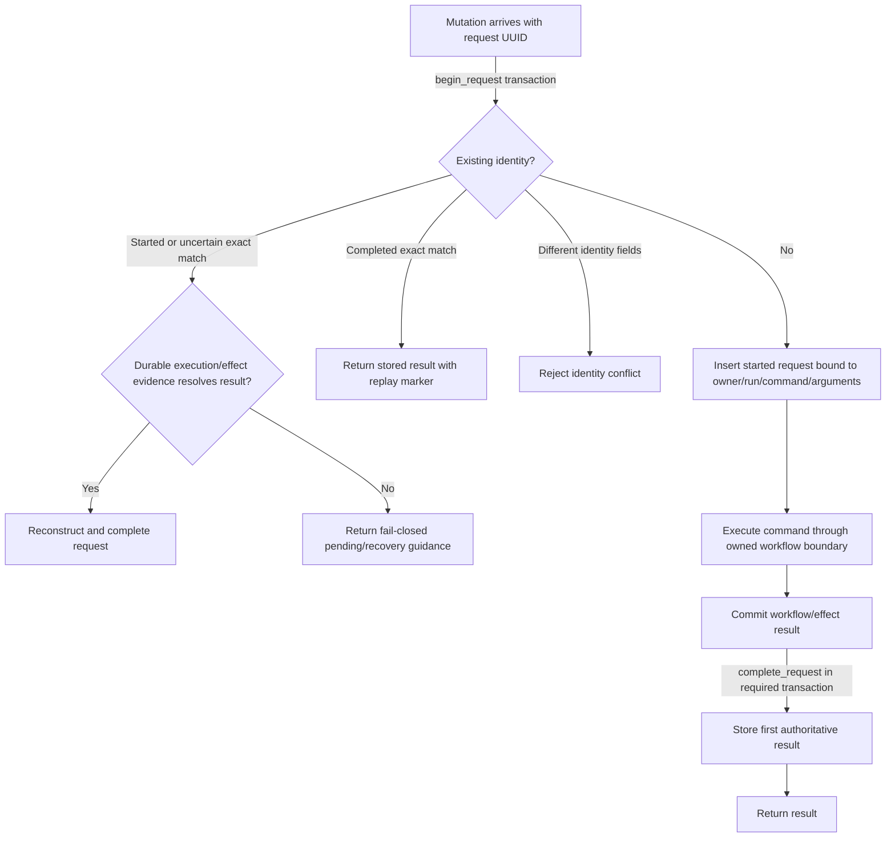

# Request replay and idempotency

## Read this when

Read this for request UUIDs, duplicate calls, lost responses, pending requests, retry guidance, backup/restore replay, planning challenges, or command idempotency.

## Scope

This document owns service request identity, first-result permanence, and reconstruction rules. It does not own workflow transition semantics or external-effect adjudication.

## Authoritative implementation

- Replay hash, begin, complete, stored result, and pending behavior: `dish_service/request_replay.py`.
- Agent/admin request lifecycle: `dish_service/request_coordinators.py`.
- Lease request replay: `dish_service/lease_requests.py`.
- Planning two-request gate: `dish_service/planning_intent.py`.
- Durable request schema: `dish_tool/database_schema.py`.
- Operation execution linkage: `dish_tool/operation_execution.py`.
- Backup creation identity: `dish_service/backup_creation_journal.py`, `dish_service/backup.py`.
- Restore replacement journal: `dish_service/restore_request_journal.py`, `dish_service/restore_plan.py`.
- PostgreSQL request authority: `dish_pg/workflow.py`, `dish_pg/command_port.py`, `dish_pg/postgres_service.py`.
- PostgreSQL reconciliation replay/idempotency authority: `dish_pg/transition.py`, driven by `dish_pg/reconciliation_worker.py`.

## Actors, processes, and stores

A request identity is bound to authenticated owner, client run UUID, command, and canonical arguments. SQLite stores current service requests and outcomes. The restore journal is outside SQLite because replacing SQLite would erase an ordinary in-database request. PostgreSQL stores generation-bound requests/outcomes for the target runtime.

## Authority and data ownership

The first accepted request row owns the request identity. A completed result is immutable replay authority. An incomplete row is not permission to execute again; code must inspect operation executions, backup reservations, or restoration checkpoints to determine whether a result can be reconstructed or remains pending. PostgreSQL pre-execution validation failures use the same request/outcome authority with a validation-only request kind: the stored rule-error outcome is replay authority even though no command execution exists. Corpus reconciliation uses a separate idempotency key—generation, active projection epoch, and corpus identity—whose durable run/items must be replayed compatibly rather than recreated or rewritten.

## Invariants

- A client request UUID is permanent for one logical mutation.
- Reuse is legal only for the exact same command, canonical arguments, authenticated owner, and run.
- The first authoritative success or expected failure is stored and replayed unchanged except for replay metadata.
- Pending or uncertain work is inspected/reconstructed; it is not blindly reissued.
- Replay never resolves a fresh target again: it cannot affect a replacement lease, later cycle, or different operation.
- Request completion and any coupled durable mutation that defines its result commit atomically where required.
- Read-only commands do not accept request IDs.
- PostgreSQL validation-only failures never create command executions, never consume the isolated first-request reservation, and never open ordinary mutation admission.
- Exact validation-failure replay returns the first stored rule-error outcome; a different command, arguments, owner/run binding, or stable error identity under the same UUID conflicts.
- Reconciliation replay is exact at both run and item level: the same corpus/run/item identities may resume only with compatible immutable inputs/evidence; contradictions fail closed.

## Process and transaction boundaries

`begin_request` is the identity admission boundary. Workflow/external-effect transactions own their durable facts. `complete_request` is ordered after the authoritative outcome and joins the same writer transaction when a lease or admin mutation/result must not separate.

## Normal flow

1. Canonicalize and hash the request identity fields.
2. Insert a started request or load the exact existing row.
3. Return a stored result, reject an identity conflict, or continue only for a newly admitted request.
4. Execute the command through workflow/external-effect authorities.
5. Persist the canonical result and expose `data.request_id`.
6. Exact replay returns the stored result with `data.request_replayed=true`.

## Failure, replay, recovery, and concurrency

Concurrent same-UUID callers cannot both become the first executor. PostgreSQL validation-only insertion is likewise conflict-safe: concurrent exact callers converge on the stored error outcome while mismatched reuse conflicts, without creating an execution or affecting cutover admission. A lost response after command commit is reconciled from operation execution and request evidence. Unknown-operation replay remains bound to the request rather than inventing a target. Backup creation reserves the exact output identifier before filesystem work. Restore uses append-only external checkpoints and file fingerprints; restart advances only from a matching checkpoint. Reconciliation workers fetch the complete external corpus before their authoritative transaction, then resume an existing compatible run by skipping already-recorded identical items; missing/changed immutable corpus inputs or item evidence block replay rather than being silently rebased.

## Change routing

- Change request identity fields or hashing only in `dish_service/request_replay.py` and shared schemas/tests.
- Couple a new mutation result to the same transaction when either half becoming durable alone would be unsafe.
- Use a replacement-surviving journal only for an operation that can replace/erase SQLite.
- Do not implement retry loops in CLI/HTTP that issue a new mutation without authoritative evidence.
- Persist pre-execution PostgreSQL validation errors through `WorkflowAuthorityService.record_validation_failure` / `PostgresRuntimeService.record_replay_validation_failure`; do not route them through ordinary mutation admission or synthesize a command execution.
- Change corpus reconciliation replay semantics in `dish_pg/transition.py`; keep `reconciliation_worker.py` as the process/I/O driver rather than a second owner of idempotency rules.

## Proving tests

- `tests/test_request_identity.py` proves identity binding and conflicts.
- `tests/test_action_replay_contract.py` proves Action replay requirements.
- `tests/test_request_completion_race.py` proves concurrent completion behavior.
- `tests/test_request_replay_and_restore_durability.py` proves replay across restart/restore.
- `tests/test_unknown_operation_request_replay.py` proves target-free replay behavior.
- `tests/test_lease_request_atomicity.py` proves lease mutation/result atomicity.
- `tests/postgresql/test_stage3_workflow_authority.py` and `tests/postgresql/test_stage4_command_port.py` prove target replay semantics.
- `tests/postgresql/test_postgres_runtime_validation_replay.py`, `tests/postgresql/test_postgres_runtime_validation_http.py`, `tests/postgresql/pglite/test_validation_failure_authority.py`, and `tests/postgresql/native/test_validation_replay.py` prove validation-only persistence, exact replay/conflict, and admission isolation.
- `tests/postgresql/test_reconciliation_worker.py` and native/process-failure reconciliation tests prove corpus-scoped replay/resume and immutable-input conflicts.

## Current debt and temporary compatibility

Historical pending rows that lack sufficient original request/effect identity remain blocking and require explicit recovery rather than guessed reconstruction. Backup restore necessarily uses a sibling journal rather than the ordinary request table. Legacy and PostgreSQL request IDs are separate authorities during shadowing and are compared through captured source identity rather than treated as one writable record.

## Related documents

- [Commands and surfaces](commands-and-surfaces.md)
- [Operations, leases, and fencing](operations-leases-and-fencing.md)
- [External effects and Asana](external-effects-and-asana.md)
- [ADR-0002](decisions/0002-request-identity-is-permanent.md)
