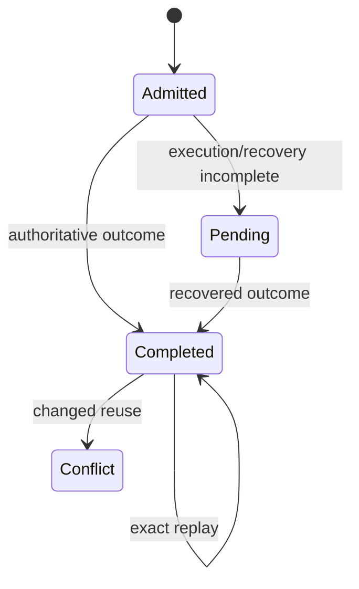

# Request replay and idempotency

## Read this when

Read this when changing mutation request IDs, duplicate requests, lost responses, validation-only admission, or replay after failure/restore.

## Scope

This document records request-identity semantics, not transport-specific retry UX.

## Authoritative implementation

Current anchors include `dish_service/request_replay.py`, `dish_service/request_coordinators.py`, SQLite request tables, `dish_pg/workflow.py`, and `dish_pg/postgres_service.py`.

## Actors, processes, and stores

Callers supply canonical mutation request IDs; current/target authorities persist admission and first authoritative outcomes.

## Authority and data ownership

A mutation request ID permanently binds the admitted command, canonical arguments, authenticated owner/run identity, and the original mutation target selected by that admitted request. Exact replay reconstructs the first authoritative result rather than resolving a fresh target or executing a second mutation.

## Invariants

- Exact reuse replays; incompatible reuse conflicts.
- A replay does not silently retarget a later operation, cycle, lease, proposal, or other nearby durable subject.
- Lost-response recovery does not require inventing a new mutation identity.
- Pending/uncertain execution is not treated as permission to reissue effects blindly.
- If administrative recovery durably resolves a request-bound execution after response loss, the service request remains authoritative and must itself be settled from that exact execution evidence before ownership transfer may proceed.
- An irreversible `kill` revocation is durably bound to the admitted kill request in the same writer transaction. That binding records the exact operation, owner, run, authority source, and revocation identity; replay follows that binding and never resolves the Dish again to choose a target.
- Validation-only failures that are part of the request contract can be durably replayed when the runtime owns them.

## Process and transaction boundaries

Admission/outcome coupling must be atomic enough to prevent two authoritative outcomes. Exact transaction implementation may differ between SQLite and PostgreSQL.

## Normal flow

Canonicalize request, reserve identity and its bound target, execute once, persist outcome, replay that outcome on exact duplicates.

## Failure, replay, recovery, and concurrency

Concurrent duplicates converge on one request identity. Lost responses are resolved from durable evidence. Reconciliation/recovery mechanisms may supply the missing authoritative outcome without changing request identity or selecting a different target.
For `kill`, a crash after revocation but before request settlement leaves the request pending with its exact kill binding already durable. Exact replay continues settlement from that binding; a successor operation remains a distinct eligible identity and is not retroactively selected by the old request.

## Change routing

Do not create transport-local idempotency semantics that compete with the shared request identity. Surface retry UX may differ as long as it preserves the same mutation identity contract.

## Proving tests

Current evidence includes `tests/test_request_identity.py`, `tests/test_request_completion_race.py`, `tests/test_action_replay_contract.py`, and PostgreSQL validation/replay tests.

## Current debt and temporary compatibility

Historical incomplete rows can remain fail-closed when evidence is insufficient. PostgreSQL and SQLite implementations still differ internally while preserving the same identity principle.

## Related documents

- [ADR-0002](decisions/0002-request-identity-is-permanent.md)
- [Operations, leases, and fencing](operations-leases-and-fencing.md)
- [PostgreSQL runtime](postgresql-runtime.md)

## Archive replay and retired work

Exact archive replay is resolved from the stored request outcome before archive-only locks, cleanup, or run
revocation work, so replay is effect-free and returns the original archived result. During the first successful
archive transaction, any other task execution that is still safely pending/claimed is cancelled and its request
is settled with terminal `TASK_ARCHIVED` retirement evidence. An uncertain execution is not guessed or retired;
it blocks archive until the existing uncertainty path establishes a safe terminal outcome.
