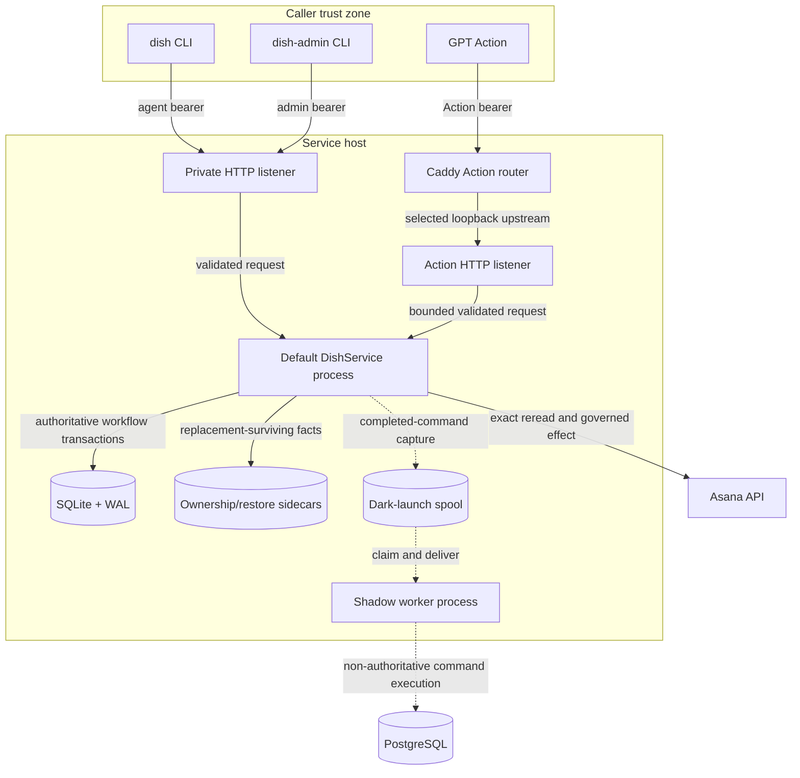

# System context

## Read this when

Read this for deployable-process changes, listener or credential changes, new workers, new stores, frontend integration, or any proposal that changes which process may mutate authority.

## Scope

This document owns the current process, store, external-system, and trust-boundary view. It does not own command semantics, workflow transition rules, or operator command sequences.

## Authoritative implementation

- Executable wrappers: `dish`, `dish-admin`, `dish-service`.
- Service composition and startup: `dish_service/__main__.py`, `dish_service/application.py`, `dish_service/config.py`.
- HTTP servers and route classes: `dish_service/http.py`, `dish_service/http_routing.py`, `dish_service/auth.py`.
- Current persistence and external boundary: `dish_tool/database_initialization.py`, `dish_tool/database_schema.py`, `dish_tool/task_gateway.py`, `dish_tool/backend.py`.
- Deployable definitions: `deploy/systemd/dish-service-test.service`, `deploy/systemd/dish-service-prod.service`, `deploy/systemd/dish-action-router.service`, `deploy/systemd/dish-shadow-worker.service`.
- PostgreSQL rehearsal process: `dish_service/__main__.py`, `dish_pg/postgres_service.py`.
- Read-only production dark-launch preparation/preflight: `dish_pg/location_manifest.py`, `dish_pg/legacy_source.py`, `dish_pg/dark_launch_readiness.py`.

## Actors, processes, and stores

Actors are agent CLI callers, the GPT Action, Marco/admin, and the external Asana service. Deployable processes are one default `dish-service` process per environment, the Caddy Action router, and—only when explicitly enabled—the separate dark-launch shadow worker. Local direct CLI mode exists only for controlled single-agent testing.

## Authority and data ownership

The default service process is the only supported shared mutation authority. Clients own only local argument parsing, candidate-file reads, and rendering. Tokens are scoped by surface. SQLite is service-owned current workflow authority; Asana is current document/placement authority. The PostgreSQL rehearsal process is explicitly TEST-only and rejects reachable Asana environment variables. Production dark-launch source capture/export/readiness are separate operator processes with read-only source/target inspection contracts; they do not become mutation authorities merely because they can observe production identities.

## Invariants

- One environment has one service process holding the canonical process lock for its governed database.
- Clients never receive the writable database path or the Asana credential.
- The public Action listener cannot route admin, backup, restore, migration, health, or generic private commands.
- Listener routing does not transfer data authority.
- `--postgresql-test-runtime` is not a production switch: it requires `DISH_PROFILE=test`, a disposable `dish_*_test` database, and no reachable Asana configuration.
- The frontend under `frontend/` remains a separate delivery surface until its explicit integration gates are implemented.
- Production dark-launch preflight cannot start/stop/enable/modify systemd units, create spool/checkpoint/import/baseline/epoch authority, or leak credential values; worker-unit inspection is `systemctl show` against an expected disabled/inactive unit and isolated environment file.

## Process and transaction boundaries

The default service opens the SQLite authority, performs startup validation, then serves private and Action listeners in one process. Request handlers cross a shared admission gate before authentication/body parsing and delegate to service coordinators. SQLite transactions are command-scoped. Asana calls occur outside local transactions only after durable intent is recorded. The shadow worker and PostgreSQL workers own their own SQLAlchemy sessions and transaction boundaries.

## Normal flow

1. A caller selects the private or Action surface and authenticates with the matching bearer scope.
2. The HTTP handler validates media type, duplicate-free JSON, client identifiers, and command shape.
3. `DishService` and a request coordinator open the current authority, perform replay and lease gates, and construct the command application.
4. The workflow command commits local intent/evidence and performs any exact Asana effect through the gateway.
5. The service completes replay state, releases safe cleanup tails, and returns the canonical envelope.
6. When dark launch is enabled, completion capture is supplemental and fail-open with respect to the legacy command result.

## Failure, replay, recovery, and concurrency

Shutdown closes admission before listener teardown; admitted requests drain. A copied checkout or database is not a lock. Service-owned markers are policy evidence, while OS process locks are the actual process exclusion mechanism. Recoverable startup dependency failures may leave only diagnosis/restore surfaces available. Separate worker processes recover from durable claims, attempts, and checkpoints rather than process memory.

## Change routing

- Change listener topology in `dish_service/http.py` and `dish_service/__main__.py`; do not encode workflow rules there.
- Change authentication in `dish_service/auth.py`; do not pass credentials into clients.
- Add a durable store only after deciding which process owns it and whether it must survive database replacement.
- Do not add a second live mutation process, direct writable CLI path, or frontend mutation path.

## Proving tests

- `tests/test_action_surface.py` proves public/private surface separation.
- `tests/test_transport_contract_resilience.py` proves transport validation, shutdown, and fail-closed boundaries.
- `tests/test_service_clients_auth.py` proves client credential/profile behavior.
- `tests/test_action_router_switch.py` proves router selection without authority transfer.
- `tests/test_database_concurrency_constraints.py` and `tests/test_compatibility_database_boundary.py` prove shared database/process constraints.
- `tests/postgresql/test_production_shaped_runtime_contracts.py` proves TEST-only PostgreSQL runtime isolation contracts, not current rehearsal completion.
- `tests/postgresql/test_location_manifest_filesystem_safety.py` and `tests/postgresql/test_dark_launch_readiness_systemd.py` prove production source/path and stopped-unit isolation.

## Current debt and temporary compatibility

The repository contains both legacy SQLite production runtime and a substantially implemented PostgreSQL target. The default executable still selects SQLite unless the explicit TEST rehearsal flag is supplied. The systemd tree contains the dark-launch shadow worker but no production projection or reconciliation worker units. The frontend is not a current authority surface.

## Related documents

- [Authority and data ownership](authority-and-data-ownership.md)
- [Commands and surfaces](commands-and-surfaces.md)
- [PostgreSQL runtime](postgresql-runtime.md)
- [Dark launch](dark-launch.md)
- [`../../README.md`](../../README.md)
