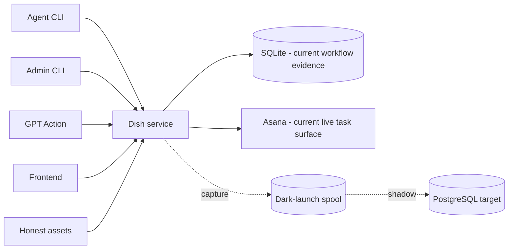

# System context

## Read this when

Read this when changing deployable processes, trust boundaries, mutation entry points, or the relationship among frontend, service, Asana, SQLite, and PostgreSQL.

## Scope

This document describes system actors and runtime boundaries. It does not prescribe file placement or developer workflow.

## Authoritative implementation

Current anchors include `dish_service/__main__.py`, `dish_service/http.py`, `dish_service/auth.py`, `dish_tool/database.py`, `dish_tool/task_gateway.py`, `dish_pg/postgres_service.py`, and dark-launch components under `dish_pg/` and `dish_service/`.

## Actors, processes, and stores

The important boundary is the Dish service authority, not a particular client. CLI, GPT Action, admin tools, and frontend may have different presentation, capability, and authentication logic while sharing the same mutation authority.

## Authority and data ownership

Clients do not own durable workflow truth. The service coordinates current workflow authority and current Asana effects. PostgreSQL is the intended replacement canonical backend after cutover. Asana is transitional and is intended to disappear once frontend functionality and backend reliability make that safe.

## Invariants

- All live mutations, including frontend mutations, go through the shared Dish service authority rather than a second writable backend path.
- Authentication/authorization are explicit per caller/surface; capability overlap between surfaces is allowed.
- Clients do not receive database paths or backend credentials.
- Dark launch does not transfer authority.
- Shadow-origin work cannot cause live external effects.

## Process and transaction boundaries

Transport processes authenticate and validate their own protocol concerns, then invoke application/runtime authority. The architecture does not require transports to be logic-free; it requires them not to become competing authorities for workflow transitions or durable facts.

## Normal flow

A caller authenticates, submits a command, the service evaluates authoritative state and policy, persists required intent/evidence, performs any governed effect, and returns a result adapted to that caller's surface.

## Failure, replay, recovery, and concurrency

Failures are handled by the replay/lease/effect mechanisms described in the linked documents. A transport failure does not create a second state authority.

## Change routing

Changing client UX, response guidance, parsing, capability display, or transport adaptation may legitimately happen in that surface. Changing the authoritative legality or durable result of a workflow transition belongs to the workflow/application authority. Do not infer permanent module placement from this description.

## Proving tests

Current relevant evidence includes `tests/test_action_surface.py`, `tests/test_transport_contract_resilience.py`, and PostgreSQL production-shaped/runtime contract tests under `tests/postgresql/`.

## Current debt and temporary compatibility

SQLite + Asana are the current production split. PostgreSQL and the frontend are replacement directions. The architecture should not treat Asana or current module topology as permanent end-state constraints.

## Related documents

- [Authority and data ownership](authority-and-data-ownership.md)
- [Commands and surfaces](commands-and-surfaces.md)
- [PostgreSQL runtime](postgresql-runtime.md)
- [Dark launch](dark-launch.md)
